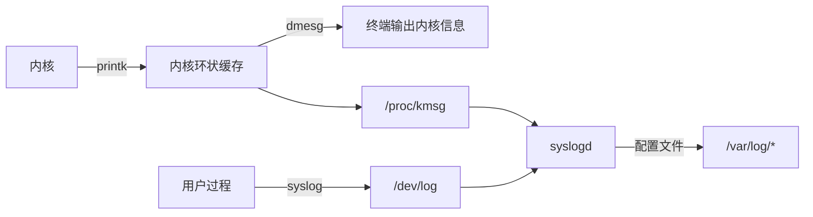

# 服务器程序规范

- 以后台形式运行，又称守护进程。没有控制终端，不会意外收到用户输入。父进程是init进程(PID=1)
- 有一套日志系统，大部分后台进程在/var/log下有自己的日志目录
- 一般以某个专门的非root身份运行
- 可配置，能处理很多命令行选项，或用配置文件来管理，存放在/etc目录下
- 通常在启动时生成一个pid文件存入/var/run目录中，以记录该后台进程的PID，比如/var/run/syslogd.pid
- 需要考虑系统资源和限制，以预测自身能承受多大负荷，比如进程可用文件描
述符总数和内存总量等。

## 日志

### Linux系统日志

日志系统: rsyslogd或systemd-journald

既能接收用户进程输出的日志，又能接收内核日志。用户进程是通过调用syslog函数生成系统日志的。输出到UNIX本地域socket类型`/dev/log`中，守护进程监听该文件。内核日志由printk等函数打印至内核的环状缓存中，该缓存内容直接映射至`/proc/kmsg`中，日志守护进程通过读取该文件获取内核日志。

配置文件略，可看[archlinux wiki](https://wiki.archlinuxcn.org/wiki/Systemd/Journal)



### syslog函数

```c
#include <syslog.h>
void syslog(int priority, const char *message, ...);

#define LOG_EMERG 0/*系统不可用*/
#define LOG_ALERT 1/*报警，需要立即采取动作*/
#define LOG_CRIT 2/*非常严重的情况*/
#define LOG_ERR 3/*错误*/
#define LOG_WARNING 4/*警告*/
#define LOG_NOTICE 5/*通知*/
#define LOG_INFO 6/*信息*/
#define LOG_DEBUG 7/*调试*/
```

- priority 设施值与日志级别的按位或，设施值默认为LOG_USER，级别见上
- message与... 格式化输出

改变默认输出格式，进一步结构化日志内容:

```c
#include <syslog.h>
void openlog(const char*ident, int logopt, int facility);

#define LOG_PID 0x01/*在日志消息中包含程序PID*/
#define LOG_CONS 0x02/*如果消息不能记录到日志文件，则打印至终端*/
#define LOG_ODELAY 0x04/*延迟打开日志功能直到第一次调用syslog*/
#define LOG_NDELAY 0x08/*不延迟打开日志功能*/
```

- ident 指定的字符串将被加到日期和时间之后，通常被设置为程序名字
- logopt 配置后续syslog调用的行为，可取以上值的按位或
- facility 可用来修改syslog函数中的默认设施值

日志的过滤也很重要，程序在开发阶段可能需要输出很多调试信息，而发布之后我们又需要将这些调试信息关闭。解决这个问题的方法是通过设置日志掩码，使日志级别大于日志掩码的日志信息被系统忽略，而不是删除调试代码（因为日后可能还需要用到）。用于设置syslog的日志掩码的函数:

```c
#include <syslog.h>
int setlogmask(int maskpri); //指定掩码值并返回先前掩码值，始终会成功
```

关闭日志功能:

```c
#include <syslog.h>
void closelog();
```

## 用户信息

### UID、EUID、GID、EGID

用户信息对于服务器的安全性来说很重要，比如大部分服务器程序要求以root身份启动，但不能以root身份运行。

```c
#include <sys/types.h>
#include <unistd.h>
uid_t getuid();
uid_t geteuid();
gid_t getgid();
gid_t getegid();
int getuid(uid_t uid);
int geteuid(uid_t uid);
int getgid(gid_t gid);
int getegid(gid_t gid);
```

分别对真实id和有效id进行操作。euid的存在目的为方便资源访问，使运行程序的用户拥有该程序的有效用户的权限。比如su程序可以修改自己账号的信息，需要访问/etc/passwd文件，而su程序的所有者是root，并设置了set-user-id标志。这种进程称为特权进程。

### 切换用户

```c
static bool switch_to_user(uid_t user_id, gid_t gp_id)
{
    /*先确保目标用户不是root*/
    if((user_id == 0) && (gp_id == 0))
        return false;
    /*确保当前用户是合法用户：root或者目标用户*/
    gid_t gid = getgid();
    uid_t uid = getuid();
    if(((gid != 0) || (uid != 0)) && ((gid != gp_id) || (uid != user_id)))
        return false;
    /*如果不是root，则已经是目标用户*/
    if(uid != 0)
        return true;
    /*切换到目标用户*/
    if((setgid(gp_id) < 0) || (setuid(user_id) < 0))
        return false;
    return true;
}
```

## 进程间关系

### 进程组

每个进程都隶属于一个进程组(PGID)。每个进程组都有一个首领进程，其PGID和PID相同。进程组将一直存在，直到其中所有进程都退出，或者加入到其他进程组。一个进程只能设置自己或者其子进程的PGID。并且，当子进程调用exec系列函数后，我们也不能再在父进程中对它设置PGID。

```c
#include <unistd.h>
pid_t getpgid(pid_t pid); //成功返回进程pid所属pgid，失败返回-1并设errno
int setpgid(pid_t pid, pid_t pgid); //pid为0时对象为当前进程，pgid为0时认为pgid与pid相同，成功返回0，失败返回-1并设errno
```

### 会话

一些有关联的进程组将形成一个会话(session)，Linux未提供会话ID的概念，但认为等于会话首领所在进程组的pgid。

```c
#include <unistd.h>
pid_t setsid(); //创建一个会话，失败返回-1，设置errno
pid_t getsid(pid_t pid); //读取sid
```

`setsid()`函数不能由进程组的首领进程调用，否则产生错误。非首领进程调用时创建新会话，且有以下效果:

- 调用进程成为会话首领，此时该进程是新会话唯一成员
- 新建一个进程组，其PGID为调用进程的PID，调用进程成为该组首领
- 调用进程将甩开终端(もしあれば)

### 用ps命令查看进程关系

```shell
> ps -o pid,ppid,pgid,sid,comm|less
     PID    PPID    PGID     SID COMMAND
   45005   44925   45005   45005 zsh
   51145   45005   51145   45005 ps
   51146   45005   51145   45005 less   
```

ps和less命令的父进程是zsh命令，三条命令创建了一个会话(45005)和两个进程组(45005、51145)，zsh命令是会话首领和组首领，ps命令是组首领。

## 系统资源限制

程序会受资源限制影响，如物理设备限制(CPU数量、内存容量等)、系统策略限制(CPU时间等)，以及具体实现的限制。读取和设置Linux系统资源限制的函数:

```c
#include <sys/resource.h>
//成功返回0，失败返回-1并设errno
int getrlimit(int resource, struct rlimit *rlim);
int setrlimit(int resource, const struct rlimit *rlim);

struct rlimit {
    rlim_t rlim_cur;
    rlim_t rlim_max;
};
```

rlim_t是整数类型，描述资源级别。rlim_cur指定资源的软限制，是建议性的、最好不要超越的限制，如果超越系统可能发送信号以终止运行，rlim_max指定资源的硬限制。硬限制一般指软限制上限，普通程序可以减少硬限制，只有root身份运行的程序可以增加硬限制。

resource参数指定资源限制类型，下表列举较重要资源类型。

| 资源限制类型       | 含义 |
| ----------------- | ---- |
| RLIMIT_AS         | 虚拟内存总量限制(单位是字节)，超过限制将使某些函数(如mmap)产生ENOMEM错误 |
| RLIMIT_CORE       | 进程核心转储文件(core dump)的大小限制(单位是字节)，值为0表示不产生核心转储文件 |
| RLIMIT_CPU        | 进程CPU时间限制(单位是秒) |
| RLIMIT_DATA       | 进程数据段(data段、bss段和堆)限制(单位是字节) |
| RLIMIT_FSIZE      | 文件大小限制(单位是字节)，超过限制将使某些函数(如write)产生EFBIG错误 |
| RLIMIT_NOFILE     | 文件描述符数量限制，超过限制将使某些函数(如pipe)产生EMFILE错误 |
| RLIMIT_NPROC      | 用户能创建的进程数限制，超过限制将使某些函数(如fork)产生EAGAIN错误 |
| RLIMIT_SIGPENDING | 用户能挂起的信号数量限制 |
| RLIMIT_STACK      | 进程栈内存限制(单位是字节)，超过限制将引起SIGSEGV信号 |

## 改变工作目录和根目录

例如Web服务器的服务器程序需要改变工作目录和根目录。一般来说，Web服务器的逻辑根目录并非文件系统的根目录"/"，而是站点的根目录"/var/www"。

关于工作目录的函数:

```c
#include <unistd.h>
char *getcwd(char *buf, size_t size);
int chdir(const char *path);
```

- getcwd函数获取进程当前工作目录
  - buf指向用于存储进程当前工作目录的绝对路径名的内存
  - size指定内存大小
  - 如果size不够，返回NULL，并设置errno为ERANGE。如果buf为NULL且size非0，则在内部调用malloc，我们需要自己释放这部分内存。成功返回指向存储区的指针，失败返回NULL并设置errno
- chdir函数的path参数指定要切换到的目标目录。成功时返回0，失败时返回-1并设置errno。

改变进程根目录的函数:

```c
#include <unistd.h>
int chroot(const char *path);
```

path参数指定要切换到的目标目录。成功时返回0，失败时返回-1并设置errno。不改变当前工作目录，仍需要使用chdir。且改变之后可能无法访问/dev的文件和目录，但原先打开的文件描述符仍有效。只有特权进程能改变根目录。

## 服务器程序后台化

```c
#include <unistd.h>
int daemon(int nochdir, int noclose);
```

- nochdir指定是否改变工作目录，传递0，工作目录被设置为"/"，否则继续使用当前工作目录。
- noclose参数为0时，标准输入、标准输出和标准错误输出都被重定向到/dev/null文件，否则依然使用原来的设备。
- 成功时返回0，失败则返回-1并设置errno。

具体实现:

```c
bool daemonize()
{
    /*创建子进程，关闭父进程，这样可以使程序在后台运行*/
    pid_t pid = fork();
    if(pid < 0)
        return false;
    else if(pid > 0)
        exit(0);
    /*设置文件权限掩码。当进程创建新文件（使用open(const char *pathname, int flags, mode_t mode)系统调用）时，文件的权限将是mode&0777*/
    umask(0);
    /*创建新的会话，设置本进程为进程组的首领*/
    pid_t sid = setsid();
    if(sid < 0)
        return false;
    /*切换工作目录*/
    if((chdir("/")) < 0)
        return false;
    /*关闭标准输入设备、标准输出设备和标准错误输出设备*/
    close(STDIN_FILENO);
    close(STDOUT_FILENO);
    close(STDERR_FILENO);
    /*关闭其他已经打开的文件描述符，代码省略*/
    /*将标准输入、标准输出和标准错误输出都定向到/dev/null文件*/
    open("/dev/null", O_RDONLY);
    open("/dev/null", O_RDWR);
    open("/dev/null", O_RDWR);
    return true;
}
```
