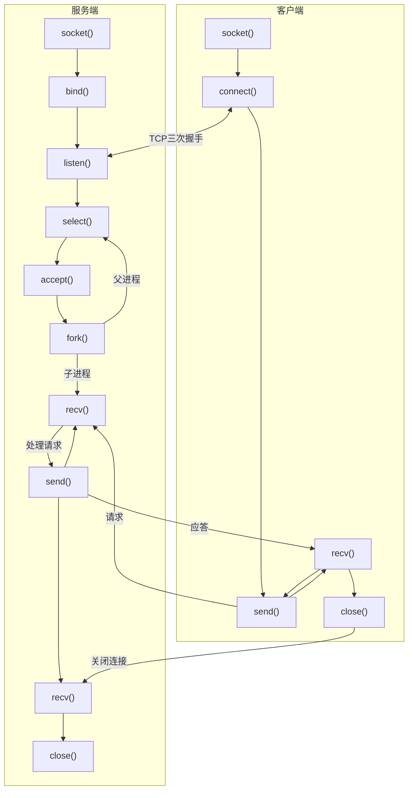
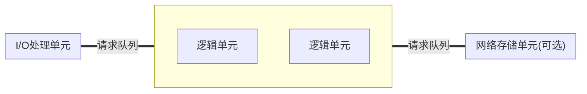
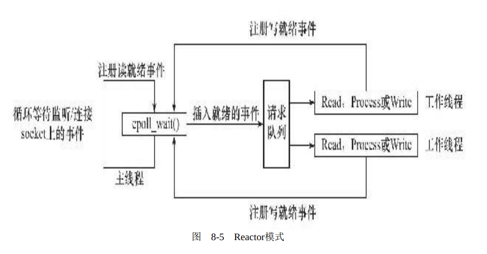
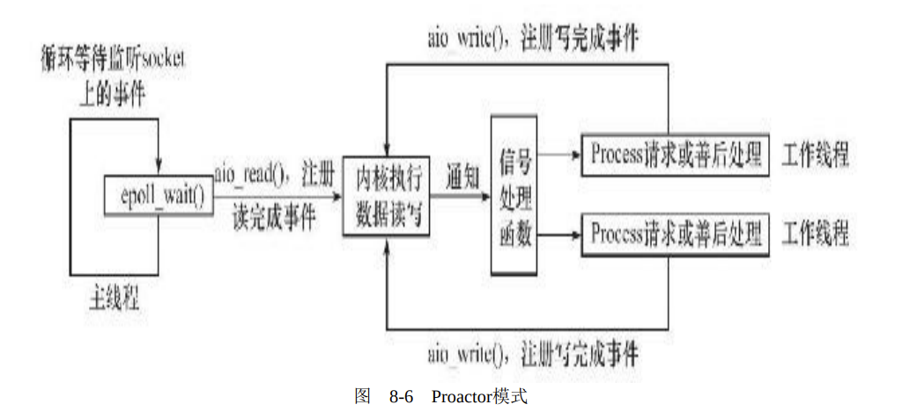
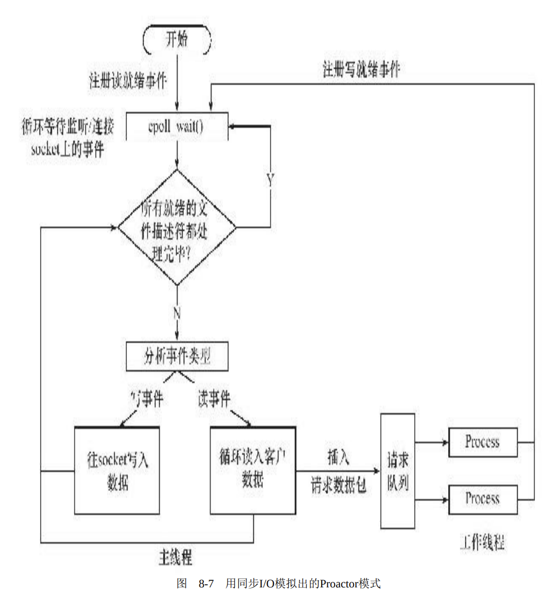
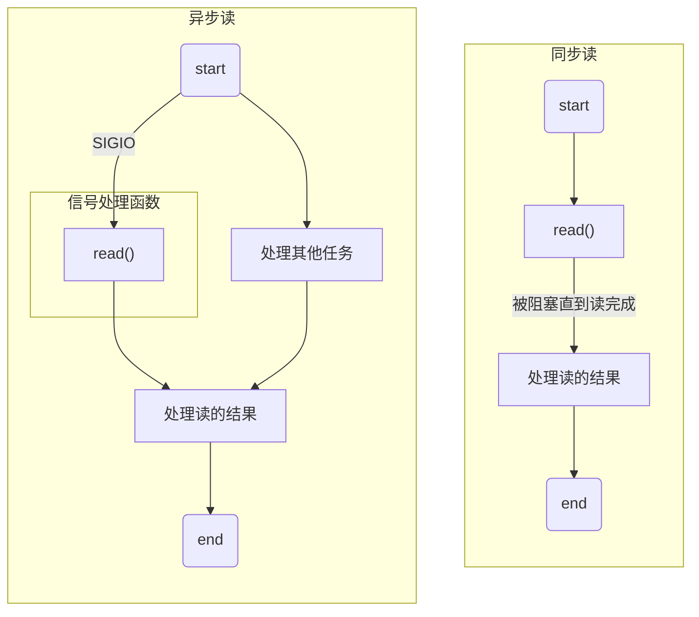
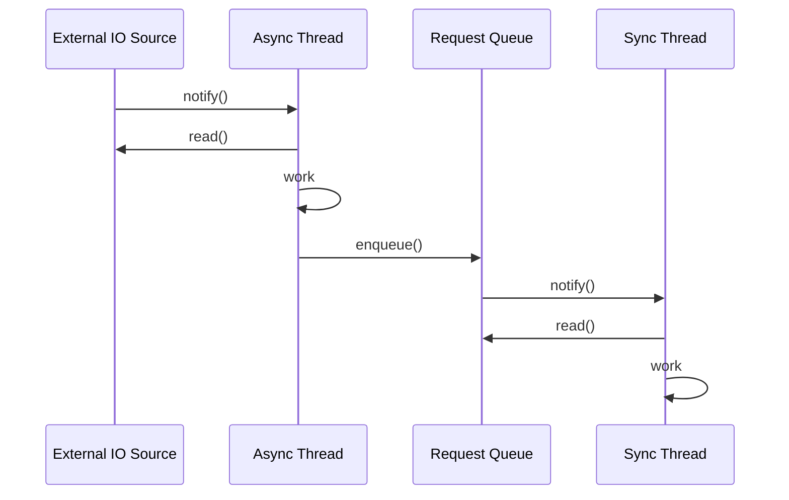
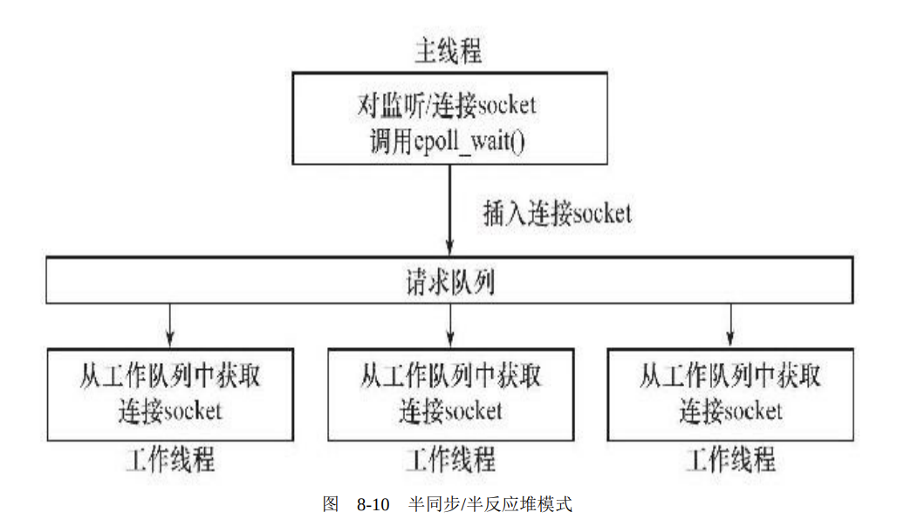
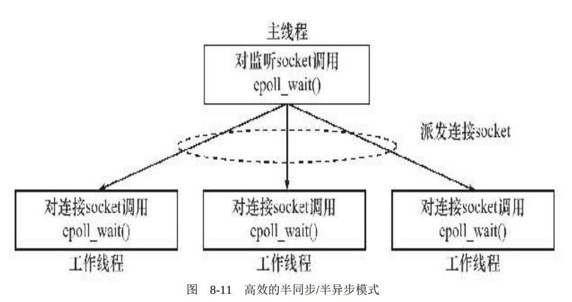
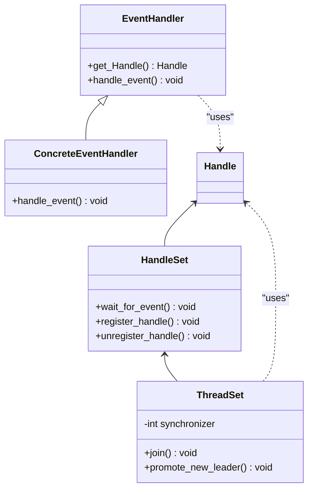

# 高性能服务器程序框架

[TOC]

全书核心和后续章节的总览。本章将服务器拆分为以下三个模块:

- I/O处理单元 四种IO模型和两种高效事件处理模式
- 逻辑单元 两种高效并发模式，以及高效逻辑处理模式——有限状态机
- 存储单元 本书不讨论，因为不是必需模块

## 服务器模型

### C/S模型

由于服务器垄断资源形成的拓扑模型，下图中服务器同时监听多个客户请求是通过select系统调用实现的。



实现简单，缺点为网络负载集中于服务器

### P2P模型

每台机器在消耗服务的同时也给别人提供服务，这样资源能够充分、自由地共享。缺点是用户间传输请求过多时网络负载会加重。

由于用户间很难互相发现，可以增加专门的发现服务器，通常提供查找服务(甚至内容服务)。

P2P模型可以看作C/S模型的扩展，每台主机既是服务端又是客户端。因此仍采用C/S模型讨论网络编程。

## 服务器编程框架



上图表示服务器的基本框架，能用来描述一台服务器或一个服务器集群。两种情况下各部件的含义与功能如下所示:

| 模块         | 单个服务器程序             | 服务器集群                 |
| ------------ | -------------------------- | -------------------------- |
| I/O处理单元  | 处理客户连接，读写网络数据 | 作为接入服务器实现负载均衡 |
| 逻辑单元     | 业务进程或线程             | 逻辑服务器                 |
| 网络存储单元 | 本地数据库、文件或缓存     | 数据库服务器               |
| 请求队列     | 各单元间的通信方式         | 各服务器间的永久TCP连接    |

## I/O模型

- 阻塞I/O 可能阻塞，如connect调用需要等待三次握手。可能阻塞的系统调用包括accept、send、recv、connect
- 非阻塞I/O 总是立即返回，不管事件是否已发生。如果未立即发生，返回-1并设errno。根据errno区分出错或等待事件: accept、send、recv通常为EAGAIN(再来一次)或EWOULDBLOCK(期望阻塞)，connect为EINPROGRESS(在处理中)。
  非阻塞I/O通常要和其他I/O通知机制一起使用，比如I/O复用和SIGIO信号。
  - I/O复用 最常用 应用程序通过I/O复用函数向内核注册一组事件，内核通过该函数把其中就绪的事件通知给应用程序。Linux上常用的I/O复用函数是select、poll、epoll_wait。需要指出，这些函数本身是阻塞的，能提高程序效率的原因是具有同时监听多个I/O事件的能力。
  - SIGIO 可用于报告I/O事件。6.8节的最后一段提到，为一个目标文件描述符指定宿主进程后宿主进程将捕获到SIGIO信号。当目标文件描述符上有事件发生时，SIGIO信号的信号处理函数将被触发，也就可以在该信号处理函数中对目标文件描述符执行非阻塞I/O操作了。
- 异步I/O 前三种都是同步I/O模型，因为I/O的读写操作，都发生在I/O事件之后，由引用程序完成。而(POSIX规范定义的异步I/O模型中)异步I/O的读写操作总是立即返回，而不论I/O是否是阻塞的，因为真正的读写操作已经由内核接管。可以说，同步I/O向应用程序通知的是I/O就绪事件，而异步I/O向应用程序通知的是I/O完成事件。Linux环境下，`<aio.h>`中定义的函数提供了对异步I/O的支持。不是本书重点，只做简单讨论。

I/O模型对比:

| I/O模型 | 读写操作和阻塞阶段                                                        |
| ------- | ------------------------------------------------------------------------- |
| 阻塞I/O | 程序阻塞于读写函数                                                        |
| I/O复用 | 阻塞于I/O复用系统调用，但可同时监听多个I/O事件。对I/O本身的操作是非阻塞的 |
| SIGIO   | 信号触发读写就绪事件，用户程序执行读写操作。没有阻塞阶段                  |
| 异步I/O | 内核执行读写操作并触发读写完成事件。没有阻塞阶段                          |

## 两种高效事件处理模式

服务器需通常要处理三种事件: I/O事件、信号及定时事件。本节讨论Reactor与Proactor事件处理模式。

同步I/O模型通常用于实现Reactor模式，异步I/O模型则实现Proactor模式。我们也可以使用同步I/O模拟出Proactor模式。

### Reactor模式

要求主线程(I/O处理单元)只负责监听文件描述符上是否有事件发生，有的话就立即通知工作线程(逻辑单元)。除此之外主线程不做任何其他实质性的工作。读写数据、接受新连接以及处理客户请求均在工作线程中完成。

工作流程:

1. 主线程往epoll内核事件表中注册socket上的读就绪事件。
2. 主线程调用epoll_wait等待socket上有数据可读。
3. 当socket上有数据可读时，epoll_wait通知主线程。主线程则将socket可读事件放入请求队列。
4. 睡眠在请求队列上的某个工作线程被唤醒，它从socket读取数据，并处理客户请求，然后往epoll内核事件表中注册该socket上的写就绪事件。
5. 主线程调用epoll_wait等待socket可写。
6. 当socket可写时，epoll_wait通知主线程。主线程将socket可写事件放入请求队列。
7. 睡眠在请求队列上的某个工作线程被唤醒，它往socket上写入服务器处理客户请求的结果。



工作线程从请求队列中取出事件后，将根据事件的类型来决定如何处理它：对于可读事件，执行读数据和处理请求的操作；对于可写事件，执行写数据的操作。因此上图所示的Reactor模式中，没必要区分所谓的“读工作线程”和“写工作线程”。

### Proactor模式

与Reactor模式不同，Proactor模式将所有I/O操作都交给主线程和内核来处理，工作线程仅仅负责业务逻辑。

使用异步I/O模型(以aio_read和aio_write为例)实现的Proactor模式的工作流程是:

1. 主线程调用aio_read函数向内核注册socket上的读完成事件，并告诉内核用户读缓冲区的位置，以及读操作完成时如何通知应用程序（这里以信号为例，详情请参考sigevent的man手册）。
2. 主线程继续处理其他逻辑。
3. 当socket上的数据被读入用户缓冲区后，内核将向应用程序发送一个信号，以通知应用程序数据已经可用。
4. 应用程序预先定义好的信号处理函数选择一个工作线程来处理客户请求。工作线程处理完客户请求之后，调用aio_write函数向内核注册socket上的写完成事件，并告诉内核用户写缓冲区的位置，以及写操作完成时如何通知应用程序（仍然以信号为例）。
5. 主线程继续处理其他逻辑。
6. 当用户缓冲区的数据被写入socket之后，内核将向应用程序发送一个信号，以通知应用程序数据已经发送完毕。
7. 应用程序预先定义好的信号处理函数选择一个工作线程来做善后处理，比如决定是否关闭socket。



在图8-6中，连接socket上的读写事件是通过aio_read/aio_write向内核注册的，因此内核将通过信号来向应用程序报告连接socket上的读写事件。所以，主线程中的epoll_wait调用仅能用来检测监听socket上的连接请求事件，而不能用来检测连接socket上的读写事件。

### 模拟Proactor模式

参考文献[^1]提到了使用同步I/O方式模拟出Proactor模式的一种方法。其原理是：主线程执行数据读写操作，读写完成之后，主线程向工作线程通知这一“完成事件”。那么从工作线程的角度来看，它们就直接获得了数据读写的结果，接下来要做的只是对读写的结果进行逻辑处理。

使用同步I/O模型（仍然以epoll_wait为例）模拟出的Proactor模式的工作流程如下：

1. 主线程往epoll内核事件表中注册socket上的读就绪事件。
2. 主线程调用epoll_wait等待socket上有数据可读。
3. 当socket上有数据可读时，epoll_wait通知主线程。主线程从socket循环读取数据，直到没有更多数据可读，然后将读取到的数据封装成一个请求对象并插入请求队列。
4. 睡眠在请求队列上的某个工作线程被唤醒，它获得请求对象并处理客户请求，然后往epoll内核事件表中注册socket上的写就绪事件。
5. 主线程调用epoll_wait等待socket可写。
6. 当socket可写时，epoll_wait通知主线程。主线程往socket上写入服务器处理客户请求的结果。



## 两种高效并发模式

适合I/O密集型而非计算密集型(对于多核CPU还成立吗)，可使被I/O阻塞的线程让出CPU。

并发模式是指I/O处理单元和多个逻辑单元之间协调完成任务的方法。服务器主要有两种并发编程模式：半同步/半异步(half-sync/half-async)模式和领导者/追随者(leader/followers)模式

### 半同步/半异步模式

这里的同步/异步与I/O模型中的同步/异步是不同的概念。在I/O模型中，“同步”和“异步”区分的是内核向应用程序通知的是何种I/O事件，以及该由谁来完成I/O读写。在并发模式中，"同步"指的是程序完全按照代码序列的顺序运行，"异步"指程序的执行需要系统事件来驱动。常见的系统信号包括中断、信号等。比如下图分别为同步和异步的读操作。



按照同步方式运行的线程称为同步线程，按照异步方式运行的线程称为异步线程。显然，异步线程的执行效率高，实时性强，这是很多嵌入式程序采用的模型。但编写以异步方式执行的程序相对复杂，难于调试和扩展，而且不适合于大量的并发。而同步线程则相反，它虽然效率相对较低，实时性较差，但逻辑简单。因此，对于像服务器这种既要求较好的实时性，又要求能同时处理多个客户请求的应用程序，我们就应该同时使用同步线程和异步线程来实现，即采用半同步/半异步模式来实现。

此模式中，同步线程用于处理客户逻辑，相当于逻辑单元；异步线程用于处理I/O事件，相当于I/O处理单元。异步线程监听到客户请求后，就将其封装成请求对象并插入请求队列中。请求队列将通知某个工作在同步模式的工作线程来读取并处理该请求对象。



变体: 半同步/半反应堆(half-sync/half-reactive)模式



异步线程只有一个，由主线程来充当。它负责监听所有socket上的事件。如果监听socket上有可读事件发生，即有新的连接请求到来，主线程就接受之以得到新的连接socket，然后往epoll内核事件表中注册该socket上的读写事件。如果连接socket上有读写事件发生，即有新的客户请求到来或有数据要发送至客户端，主线程就将该连接socket插入请求队列中。所有工作线程都睡眠在请求队列上，当有任务到来时，它们将通过竞争（比如申请互斥锁）获得任务的接管权。这种竞争机制使得只有空闲的工作线程才有机会来处理新任务，这是合理的。

主线程插入请求队列中的任务是就绪的连接socket。这说明该图所示的半同步/半反应堆模式采用的事件处理模式是Reactor模式：它要求工作线程自己从socket上读取客户请求和往socket写入服务器应答。这就是该模式的名称中“half-reactive”的含义。实际上，半同步/半反应堆模式也可以使用模拟的Proactor事件处理模式，即由主线程来完成数据的读写。在这种情况下，主线程一般会将应用程序数据、任务类型等信息封装为一个任务对象，然后将其（或者指向该任务对象的一个指针）插入请求队列。工作线程从请求队列中取得任务对象之后，即可直接处理之，而无须执行读写操作了。我们将在第15章给出一个用半同步/半反应堆模式实现的简单Web服务器的代码。

缺点:

- 主线程和工作线程共享请求队列。主线程往请求队列中添加任务，或者工作线程从请求队列中取出任务，都需要对请求队列加锁保护，从而白白耗费CPU时间。
- 每个工作线程在同一时间只能处理一个客户请求。如果客户数量较多，而工作线程较少，则请求队列中将堆积很多任务对象，客户端的响应速度将越来越慢。如果通过增加工作线程来解决这一问题，则工作线程的切换也将耗费大量CPU时间。

下图为一个相对高效的半同步/半异步模式，每个工作线程都能同时处理多个客户连接:



主线程只管理监听socket，连接socket由工作线程来管理。当有新的连接到来时，主线程接受之并将新返回的连接socket派发给某个工作线程，此后该新socket上的任何I/O操作都由被选中的工作线程来处理，直到客户关闭连接。

主线程向工作线程派发socket的最简单的方式，是往它和工作线程之间的管道里写数据。工作线程检测到管道上有数据可读时，就分析是否是一个新的客户连接请求到来。如果是，则把该新socket上的读写事件注册到自己的epoll内核事件表中。

每个线程（主线程和工作线程）都维持自己的事件循环，它们各自独立地监听不同的事件。因此，在这种高效的半同步/半异步模式中，每个线程都工作在异步模式，所以它并非严格意义上的半同步/半异步模式。我们将在第15章给出一个用这种高效的半同步/半异步模式实现的简单CGI服务器的代码。

### 领导者/追随者模式

该模式是多个工作线程轮流获得事件源集合，轮流监听、分发并处理事件的一种模式。在任意时间点，程序都仅有一个领导者线程，它负责监听I/O事件。而其他线程则都是追随者，它们休眠在线程池中等待成为新的领导者。当前的领导者如果检测到I/O事件，首先要从线程池中推选出新的领导者线程，然后处理I/O事件。此时，新的领导者等待新的I/O事件，而原来的领导者则处理I/O事件，二者实现了并发。

该模式包含以下类: 句柄集(HandleSet)、线程集(ThreadSet)、事件处理器(EventHandler)和具体的事件处理器(ConcreteEventHandler)。类图如下:



1. 句柄集
  句柄(Handle)用于表示I/O资源，在Linux下通常就是一个文件描述符。句柄集管理众多句柄，它使用wait_for_event方法来监听这些句柄上的I/O事件，并将其中的就绪事件通知给领导者线程。领导者则调用通过register_handle方法绑定到Handle上的事件处理器来处理事件。
2. 线程集
    所有工作线程(包括领导者线程和追随者线程)的管理者。它负责各线程之间的同步，以
及新领导者线程的推选。线程集中的线程在任一时间必处于如下三种状态之一:

    - Leader: 线程处于领导者身份，负责绑定句柄集上的I/O事件
    - Processing: 线程正在处理事件，领导者检测到I/O事件后，转移到Processing状态处理事件，并调用`promote_new_leader()`方法推选新领导者；也可以指定其他追随者处理事件。处理完事件后没有领导者就被推举为领导者，否则成为追随者
    - Follower: 追随者身份，通过调用线程集的`join()`方法等待成为新的领导者，也可能被当前领导者指定处理新任务

    需要注意，为避免竞态条件，提供synchronizer成员来同步不同修改线程集的操作。

    ```mermaid
    stateDiagram-v2
    direction LR
    s1: Processing
    s2: Leader
    s3: Follower
    s2 --> s1: 处理事件
    s1 --> s2: 事件处理完成，且当前没有领导者线程
    s1 --> s3: 事件处理完成，且当前有领导者线程
    s3 --> s1: 领导者交代任务
    s3 --> s2: 被推选为新领导者
    ```

3. 事件处理器和具体的事件处理器
    事件处理器通常包含一个或多个回调函数handle_event。这些回调函数用于处理事件对应的业务逻辑。事件处理器在使用前需要被绑定到某个句柄上，当该句柄上有事件发生时，领导者就执行与之绑定的事件处理器中的回调函数。具体的事件处理器是事件处理器的派生类。它们必须重新实现基类的handle_event方法，以处理特定的任务。

(序列图略)领导者/追随者模式不需要在线程之间传递任何额外的数据，也无须像半同步/半反应堆模式那样在线程之间同步对请求队列的访问。但领导者/追随者的一个明显缺点是仅支持一个事件源集合，因此也无法像图8-11所示的那样，让每个工作线程独立地管理多个客户连接。

## 有限状态机

逻辑单元内部的一种高效编程方法: 有限状态机(finite state machine)

带状态转移的有限状态机的举例:

```cpp
void STATE_MACHINE() {
    State cur_State = type_A;
    while(cur_State != type_C) {
        Package _pack = getNewPackage();
        switch(cur_State) {
        case type_A:
            process_package_state_A(_pack);
            cur_State=type_B;
            break;
        case type_B:
            process_package_state_B(_pack);
            cur_State=type_C;
            break;
        }
    }
}
```

下面考虑有限状态机应用的一个实例：HTTP请求的读取和分析。很多网络协议，包括TCP协议和IP协议，都在其头部中提供头部长度字段。程序根据该字段的值就可以知道是否接收到一个完整的协议头部。但HTTP协议并未提供这样的头部长度字段，并且其头部长度变化也很大，可以只有十几字节，也可以有上百字节。根据协议规定，我们判断HTTP头部结束的依据是遇到一个空行，该空行仅包含一对回车换行符（`<CR><LF>`）。如果一次读操作没有读入HTTP请求的整个头部，即没有遇到空行，那么我们必须等待客户继续写数据并再次读入。因此，我们每完成一次读操作，就要分析新读入的数据中是否有空行。不过在寻找空行的过程中，我们可以同时完成对整个HTTP请求头部的分析（记住，空行前面还有请求行和头部域），以提高解析HTTP请求的效率。

## 提高性能的其它建议

### 池

资源池: 以空间换时间

内存池、进程/线程池、连接池

### 数据复制

服务器应该避免不必要的数据复制，尤其是当数据复制发生在用户代码和内核之间的时候。比如ftp服务器处理读取请求时，只需要检查文件是否存在和客户是否有读取权限，不需要将文件内容读至应用程序缓冲区并调用send函数发送，而直接使用"零拷贝"sendfile函数即可。

用户代码内部的数据复制也应该避免，比如两个进程间要传递大量数据时，应考虑共享内存而不是管道或消息队列。又比如在合适时候使用string_view而不是string(cpp)或使用&str而不是String(Rust)。

### 上下文切换和锁

并发程序必须考虑上下文切换(context switch)的问题，即进程切换或线程切换导致的的系统开销。即使是I/O密集型的服务器，也不应该使用过多的工作线程（或工作进程，下同），否则线程间的切换将占用大量的CPU时间，服务器真正用于处理业务逻辑的CPU时间的比重就显得不足了。合理的方案是允许一个线程同时处理多个客户连接/线程数不大于CPU逻辑内核数。

另一个问题是共享资源的加锁保护。锁通常被认为效率低下，因为不处理任何业务逻辑，而且需要访问内核资源。如果必须使用锁，可以考虑减小锁的粒度，比如使用读写锁。当只读不写时不会增加开销。

[^1]: Alexander Libman, Vladimir Gilbourd. Comparing Two High-Performance I/O Design Patterns \[OL]. 2005-11-25. <http://www.artima.com/articles/io_design_patterns.html>
