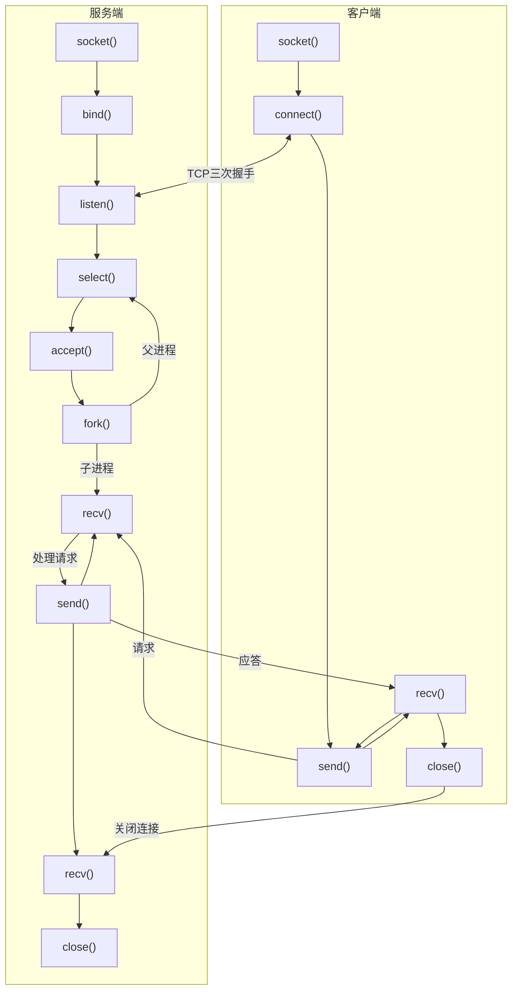
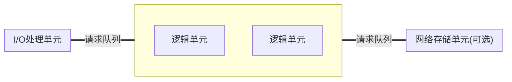

# 高性能服务器程序框架

全书核心和后续章节的总览。本章将服务器拆分为以下三个模块:

- I/O处理单元 四种IO模型和两种高效事件处理模式
- 逻辑单元 两种高效并发模式，以及高效逻辑处理模式——有限状态机
- 存储单元 本书不讨论，因为不是必需模块

## 服务器模型

### C/S模型

由于服务器垄断资源形成的拓扑模型，下图中服务器同时监听多个客户请求是通过select系统调用实现的。

实现简单，缺点为网络负载集中于服务器

### P2P模型

每台机器在消耗服务的同时也给别人提供服务，这样资源能够充分、自由地共享。缺点是用户间传输请求过多时网络负载会加重。

由于用户间很难互相发现，可以增加专门的发现服务器，通常提供查找服务(甚至内容服务)。

P2P模型可以看作C/S模型的扩展，每台主机既是服务端又是客户端。因此仍采用C/S模型讨论网络编程。

## 服务器编程框架

上图表示服务器的基本框架，能用来描述一台服务器或一个服务器集群。两种情况下各部件的含义与功能如下所示:

| 模块         | 单个服务器程序             | 服务器集群                 |
| ------------ | -------------------------- | -------------------------- |
| I/O处理单元  | 处理客户连接，读写网络数据 | 作为接入服务器实现负载均衡 |
| 逻辑单元     | 业务进程或线程             | 逻辑服务器                 |
| 网络存储单元 | 本地数据库、文件或缓存     | 数据库服务器               |
| 请求队列     | 各单元间的通信方式         | 各服务器间的永久TCP连接    |

## I/O模型

- 阻塞I/O 可能阻塞，如connect调用需要等待三次握手。可能阻塞的系统调用包括accept、send、recv、connect
- 非阻塞I/O 总是立即返回，不管事件是否已发生。如果未立即发生，返回-1并设errno。根据errno区分出错或等待事件: accept、send、recv通常为EAGAIN(再来一次)或EWOULDBLOCK(期望阻塞)，connect为EINPROGRESS(在处理中)。
  非阻塞I/O通常要和其他I/O通知机制一起使用，比如I/O复用和SIGIO信号。
  - I/O复用 最常用 应用程序通过I/O复用函数向内核注册一组事件，内核通过该函数把其中就绪的事件通知给应用程序。Linux上常用的I/O复用函数是select、poll、epoll_wait。需要指出，这些函数本身是阻塞的，能提高程序效率的原因是具有同时监听多个I/O事件的能力。
  - SIGIO 可用于报告I/O事件。6.8节的最后一段提到，为一个目标文件描述符指定宿主进程后宿主进程将捕获到SIGIO信号。当目标文件描述符上有事件发生时，SIGIO信号的信号处理函数将被触发，也就可以在该信号处理函数中对目标文件描述符执行非阻塞I/O操作了。
- 异步I/O 前三种都是同步I/O模型，因为I/O的读写操作，都发生在I/O事件之后，由引用程序完成。而(POSIX规范定义的异步I/O模型中)异步I/O的读写操作总是立即返回，而不论I/O是否是阻塞的，因为真正的读写操作已经由内核接管。可以说，同步I/O向应用程序通知的是I/O就绪事件，而异步I/O向应用程序通知的是I/O完成事件。Linux环境下，`<aio.h>`中定义的函数提供了对异步I/O的支持。不是本书重点，只做简单讨论。

I/O模型对比:

| I/O模型 | 读写操作和阻塞阶段                                                        |
| ------- | ------------------------------------------------------------------------- |
| 阻塞I/O | 程序阻塞于读写函数                                                        |
| I/O复用 | 阻塞于I/O复用系统调用，但可同时监听多个I/O事件。对I/O本身的操作是非阻塞的 |
| SIGIO   | 信号触发读写就绪事件，用户程序执行读写操作。没有阻塞阶段                  |
| 异步I/O | 内核执行读写操作并触发读写完成事件。没有阻塞阶段                          |

## 两种高效事件处理模式

服务器需通常要处理三种事件: I/O事件、信号及定时事件。本节讨论Reactor与Proactor事件处理模式。

同步I/O模型通常用于实现Reactor模式，异步I/O模型则实现Proactor模式。我们也可以使用同步I/O模拟出Proactor模式。

### Reactor模式

要求主线程(I/O处理单元)只负责监听文件描述符上是否有事件发生，有的话就立即通知工作线程(逻辑单元)。除此之外主线程不做任何其他实质性的工作。读写数据、接受新连接以及处理客户请求均在工作线程中完成。

工作流程:

1. 主线程往epoll内核事件表中注册socket上的读就绪事件。
2. 主线程调用epoll_wait等待socket上有数据可读。
3. 当socket上有数据可读时，epoll_wait通知主线程。主线程则将socket可读事件放入请求队列。
4. 睡眠在请求队列上的某个工作线程被唤醒，它从socket读取数据，并处理客户请求，然后往epoll内核事件表中注册该socket上的写就绪事件。
5. 主线程调用epoll_wait等待socket可写。
6. 当socket可写时，epoll_wait通知主线程。主线程将socket可写事件放入请求队列。
7. 睡眠在请求队列上的某个工作线程被唤醒，它往socket上写入服务器处理客户请求的结果。

工作线程从请求队列中取出事件后，将根据事件的类型来决定如何处理它：对于可读事件，执行读数据和处理请求的操作；对于可写事件，执行写数据的操作。因此上图所示的Reactor模式中，没必要区分所谓的“读工作线程”和“写工作线程”。

### Proactor模式

与Reactor模式不同，Proactor模式将所有I/O操作都交给主线程和内核来处理，工作线程仅仅负责业务逻辑。

使用异步I/O模型(以aio_read和aio_write为例)实现的Proactor模式的工作流程是:

1. 主线程调用aio_read函数向内核注册socket上的读完成事件，并告诉内核用户读缓冲区的位置，以及读操作完成时如何通知应用程序（这里以信号为例，详情请参考sigevent的man手册）。
2. 主线程继续处理其他逻辑。
3. 当socket上的数据被读入用户缓冲区后，内核将向应用程序发送一个信号，以通知应用程序数据已经可用。
4. 应用程序预先定义好的信号处理函数选择一个工作线程来处理客户请求。工作线程处理完客户请求之后，调用aio_write函数向内核注册socket上的写完成事件，并告诉内核用户写缓冲区的位置，以及写操作完成时如何通知应用程序（仍然以信号为例）。
5. 主线程继续处理其他逻辑。
6. 当用户缓冲区的数据被写入socket之后，内核将向应用程序发送一个信号，以通知应用程序数据已经发送完毕。
7. 应用程序预先定义好的信号处理函数选择一个工作线程来做善后处理，比如决定是否关闭socket。

在图8-6中，连接socket上的读写事件是通过aio_read/aio_write向内核注册的，因此内核将通过信号来向应用程序报告连接socket上的读写事件。所以，主线程中的epoll_wait调用仅能用来检测监听socket上的连接请求事件，而不能用来检测连接socket上的读写事件。

### 模拟Proactor模式

参考文献[^1]提到了使用同步I/O方式模拟出Proactor模式的一种方法。其原理是：主线程执行数据读写操作，读写完成之后，主线程向工作线程通知这一“完成事件”。那么从工作线程的角度来看，它们就直接获得了数据读写的结果，接下来要做的只是对读写的结果进行逻辑处理。

使用同步I/O模型（仍然以epoll_wait为例）模拟出的Proactor模式的工作流程如下：

1. 主线程往epoll内核事件表中注册socket上的读就绪事件。
2. 主线程调用epoll_wait等待socket上有数据可读。
3. 当socket上有数据可读时，epoll_wait通知主线程。主线程从socket循环读取数据，直到没有更多数据可读，然后将读取到的数据封装成一个请求对象并插入请求队列。
4. 睡眠在请求队列上的某个工作线程被唤醒，它获得请求对象并处理客户请求，然后往epoll内核事件表中注册socket上的写就绪事件。
5. 主线程调用epoll_wait等待socket可写。
6. 当socket可写时，epoll_wait通知主线程。主线程往socket上写入服务器处理客户请求的结果。

## 两种高效并发模式

适合I/O密集型而非计算密集型(对于多核CPU还成立吗)，可使被I/O阻塞的线程让出CPU。

并发模式是指I/O处理单元和多个逻辑单元之间协调完成任务的方法。服务器主要有两种并发编程模式：半同步/半异步(half-sync/half-async)模式和领导者/追随者(leader/followers)模式

### 半同步/半异步模式

### 领导者/追随者模式

## 有限状态机

## 提高性能的其它建议

### 池

### 数据复制

### 上下文切换和锁

[^1]: Alexander Libman, Vladimir Gilbourd. Comparing Two High-Performance I/O Design Patterns \[OL]. 2005-11-25. <http://www.artima.com/articles/io_design_patterns.html>
