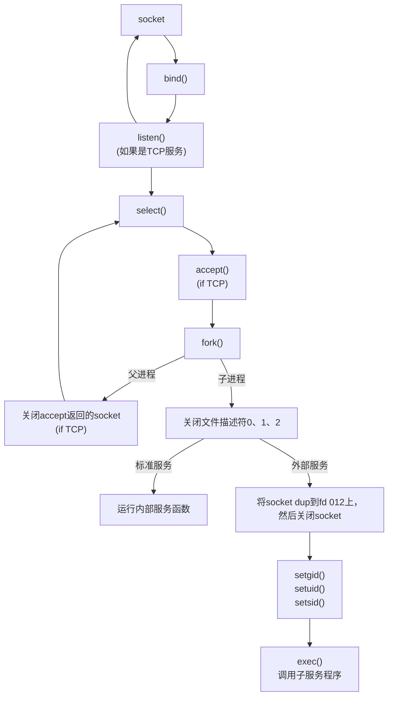

# I/O 复用

[TOC]

I/O复用使程序能同时监听多个文件描述符，对提高程序性能至关重要。通常网络程序需要使用I/O复用的情况:

- 客户端程序要同时处理多个socket。比如本章将要讨论的非阻塞connect技术
- 客户端程序要同时处理用户输入和网络连接。比如将要讨论的聊天室程序
- TCP服务器要同时处理监听socket和连接socket。I/O复用使用最多的场合
- 服务器要同时处理TCP和UDP请求，比如将要讨论的回射服务器
- 服务器要同时监听多个端口，或处理多种服务。比如将要讨论的xinetd服务器

I/O复用虽然能同时监听多个文件描述符，但它本身是阻塞的。并且当多个文件描述符同时就绪时，如果不采取额外的措施，程序就只能按顺序依次处理其中的每一个文件描述符，这使得服务器程序看起来像是串行工作的。如果要实现并发，只能使用多进程或多线程等编程手段。

Linux下实现I/O复用的系统调用主要有select、poll和epoll，本章将依次讨论并介绍几个实例。

## select系统调用

用途是：在一段指定时间内，监听用户感兴趣的文件描述符上的可读、可写和异常等事件。

### select API

```cpp
#include <sys/select.h>
int select(int nfds, fd_set *readfds, fd_set *writefds, fd_set *exceptfds, struct timeval *timeout);
```

1. nfds参数指定被监听的文件描述符的总数。它通常被设置为select监听的所有文件描述符中的最大值加1，因为文件描述符是从0开始计数的。
2. 中间3个参数分别指向可读、可写和异常等事件对应的文件描述符集合。应用程序调用select函数时，通过这3个参数传入感兴趣的文件描述符。调用返回时，内核将修改他们以告知应用程序哪些已就绪。fd_set结构体定义如下:

    ```cpp
    #include <typesizes.h>
    #define __FD_SETSIZE 1024
    #include <sys/select.h>
    #define FD_SETSIZE __FD_SETSIZE
    typedef long int __fd_mask;
    #undef __NFDBITS
    #define __NFDBITS (8*(int)sizeof(__fd_mask))
    typedef struct {
        #ifdef __USE_XOPEN
        __fd_mask fds_bits[__FD_SETSIZE / __NFDBITS];
        #define __FDS_BITS(set) ((set)->fds_bits)
        #else
        __fd_mask __fds_bits[__FD_SETSIZE / __NFDBITS];
        #define __FDS_BITS(set) ((set)->__fds_bits)
        #endif
    } fd_set;
    ```

   由以上定义可见，fd_set结构体仅包含一个整型数组，该数组的每个元素的每一位（bit）标记一个文件
描述符。fd_set能容纳的文件描述符数量由FD_SETSIZE指定，这就限制了select能同时处理的文件描述符的
总量。

   由于位操作过于烦琐，我们应该使用下面的一系列宏来访问fd_set结构体中的位：

    ```cpp
    #include <sys/select.h>
    FD_ZERO(fd_set *fdset); /*清除fdset的所有位*/
    FD_SET(int fd, fd_set *fdset); /*设置fdset的位fd*/
    FD_CLR(int fd, fd_set *fdset); /*清除fdset的位fd*/
    int FD_ISSET(int fd, fd_set *fdset); /*测试fdset的位fd是否被设置*/
    ```

3. timeout参数用于设置超时时间。采用指针是因为内核可以告知应用程序select等待了多久。但不能完全信任返回的timeout值，比如调用失败时该值不确定。如果都设置0，立即返回。如果传递NULL，将一直阻塞。

    ```cpp
    struct timeval {
        long tv_sec; /*秒数*/
        long tv_usec; /*微秒数*/
    }
    ```

4. 成功时返回就绪(可读、可写和异常)文件描述符的总数。超时期间内没有就绪的fd，返回0。select失败时返回-1并设置errno。等待期间收到信号，select立即返回-1，设errno为EINTR。

### 文件描述符就绪条件

哪些情况下文件描述符可被认为是可读:

- socket内核接收缓存区中的字节数大于或等于其低水位标记SO_RCVLOWAT。此时我们可以无阻塞地读该socket，并且读操作返回的字节数大于0。
- socket通信的对方关闭连接。此时对该socket的读操作将返回0。
- 监听socket上有新的连接请求。
- socket上有未处理的错误。此时我们可以使用getsockopt来读取和清除该错误。

哪些情况下文件描述符可被认为是可读:

- socket内核发送缓存区中的可用字节数大于或等于其低水位标记SO_SNDLOWAT。此时我们可以无阻塞地写该socket，并且写操作返回的字节数大于0。
- socket的写操作被关闭。对写操作被关闭的socket执行写操作将触发一个SIGPIPE信号。
- socket使用非阻塞connect连接成功或者失败(超时)之后。
- socket上有未处理的错误。此时我们可以使用getsockopt来读取和清除该错误。

网络程序中socket能处理的异常情况: 接收到带外数据。

### 处理带外数据

略

## poll系统调用

在指定时间内轮询一定数量的文件描述符，以测试其中是否有就绪者。

```cpp
#include <poll.h>
int poll(struct pollfd *fds, nfds_t nfds, int timeout);
```

1. fds pollfd结构类型的数组，指定所有感兴趣的文件描述符上发生的可读、可写和异常事件

    ```c
    struct pollfd {
        int fd; //文件描述符
        short events; //注册的事件
        short revents; //实际发生的事件，由内核填充
    };
    ```

    events成员告知poll监听哪些事件，是一系列事件的按位或。

    | 事件       | 描述                                             | 是否可作为输入 | 是否可作为输出 |
    | ---------- | ------------------------------------------------ | :------------: | :------------: |
    | POLLIN     | 数据(包括普通数据和优先数据)可读                 |       T        |       T        |
    | POLLRDNORM | 普通数据可读                                     |       T        |       T        |
    | POLLRDBAND | 优先级带数据可读(Linux不支持)                    |       T        |       T        |
    | POLLPRI    | 高优先级数据可读，比如TCP带外数据                |       T        |       T        |
    | POLLOUT    | 数据(包括普通数据和优先数据)可写                 |       T        |       T        |
    | POLLWRNORM | 普通数据可写                                     |       T        |       T        |
    | POLLWRBAND | 优先级带数据可写                                 |       T        |       T        |
    | POLLRDIIUP | TCP连接被对方关闭，或对方关闭了写操作。由GNU引入 |       T        |       T        |
    | POLLERR    | 错误                                             |       F        |       T        |
    | POLLHUP    | 挂起。比如管道的写端被关闭后，读端将收到该事件   |       F        |       T        |
    | POLLNVAL   | 文件描述符没有打开                               |       F        |       T        |

    一些事件是将POLLIN和POLLOUT分得更细致，由XOPEN规范定义，但Linux不完全支持。

    通常需要根据recv返回的数据判断收到有效数据还是对方关闭连接，但kernel 2.6.17开始增加了POLLRDHUP事件。

2. nfds 被监听事件集合fds的大小，类型为`unsigned long int`
3. timeout参数指定poll的超时值，单位是毫秒。当timeout为-1时，poll调用将永远阻塞，直到某个事件发生；当timeout为0时，poll调用将立即返回。
4. poll系统调用的返回值的含义与select相同。

## epoll系列系统调用

### 内核事件表

epoll是Linux特有的I/O函数。在实现和使用上和select/poll差异较大。epoll使用一组函数完成任务，把用户关心的事件放在内核里的一个事件表中，从而无须每次重复传入文件描述符集或事件集。但epoll需要使用额外的文件描述符，来唯一标识内核中的事件表。文件描述符使用epoll_create函数来创建:

```cpp
#include <sys/epoll.h>
int epoll_create(int size);
```

size参数是给内核的提示，以告知事件表需要多大。返回的文件描述符将用作其他epoll系统调用的第一个参数。

下面的函数用于操作epoll的内核事件表:

```cpp
#include <sys/epoll.h>
int epoll_ctl(int epfd, int op, int fd, struct epoll_event *event);
```

- fd 要操作的文件描述符
- op 指定操作类型
  - EPOLL_CTL_ADD 往事件表中注册fd上的事件
  - EPOLL_CTL_MOD 修改fd上的注册事件
  - EPOLL_CTL_DEL 删除fd上的注册事件
- event 指定事件

    ```cpp
    struct epoll_event {
        __uint32_t events; //epoll事件
        epoll_data_t data; //用户数据
    };

    typedef union epoll_data {
        void *ptr;
        int fd;
        uint32_t u32;
        uint64_t u64;
    } epoll_data_t;
    ```

  - events成员描述事件类型，与poll的事件类型基本相同，需要在对应宏前加上E。epoll有两个额外事件类型:EPOLLET和EPOLLONESHOT，在后面讨论。
  - data成员用于存储用户数据，其类型epoll_data_t是一个联合体
    - fd 使用最多，指定事件从属的目标文件描述符
    - ptr 指定与fd相关的用户数据 如果要将数据和fd联系起来，已实现快速的数据访问，要使用其他手段。比如放弃fd成员，在ptr指向的用户数据中包括fd
- 成功时返回0，失败时返回-1并置errno

### epoll_wait函数

epoll系列的主要接口，在一段超时事件内等待一组文件描述符上的事件。

```cpp
#include <sys/epoll.h>
int epoll_wait(int epfd, struct epoll_event *events, int max_events, int timeout);
```

- 成功返回就绪文件描述符的个数，失败返回-1并设置errno
- timeout 与poll函数相同
- maxevents 指定最多监听多少事件，必须大于0
- events 只用于输出检测到的就绪事件，极大提高了应用程序索引就绪文件描述符的效率。以下代码体现了该差别

```cpp
//poll
int ret = poll(fds, MAX_EVENT_NUMBER, -1);
//必须遍历所有已注册已找到就绪者
for(int i = 0; i != MAX_EVENT_NUMBER; ++i) {
    if(fds[i].revents & POLLIN) {
        int sockfd = fds[i].fd;
        //处理sockfd
    }
}

//epoll
int ret = epoll(epollfd, events, MAX_EVENT_NUMBER, -1);
//仅遍历就绪的ret个
for(int i = 0; i != ret; ++i) {
    int sockfd = events[i].data.fd;
    //肯定就绪，直接处理sockfd
}
```

### LT和ET模式

两种模式: LT(Level Trigger, 电平触发)和ET(Edge Trigger, 边沿触发)模式。默认LT模式，相当于一个效率较高的poll。当往内核事件表中注册一个文件描述符上的EPOLLET事件时，将以ET模式操作该文件描述符。ET是epoll的高效工作模式。

对LT模式，应用程序可以暂时不处理事件，该事件下一次仍会返回。但ET模式只会通知一次，故应用程序必须立即处理该事件。可见，ET模式在很大程度上降低了同一个epoll事件被重复触发的次数，因此效率要比LT模式高。

注意 每个使用ET模式的文件描述符都应该是非阻塞的。如果文件描述符是阻塞的，那么读或写操作将会因为没有后续的事件而一直处于阻塞状态（饥渴状态）。

根据`ltet.cpp`中代码的测试，同样发送18个字符时，lt触发了3次事件，et只触发了一次。(环境: g++ 13.2.1, C++20, O2优化)

### EPOLLONESHOT事件

即使我们使用ET模式，一个socket上的某个事件还是可能被触发多次。这在并发程序中就会引起一个问题。比如一个线程（或进程，下同）在读取完某个socket上的数据后开始处理这些数据，而在数据的处理过程中该socket上又有新数据可读（EPOLLIN再次被触发），此时另外一个线程被唤醒来读取这些新的数据。于是就出现了两个线程同时操作一个socket的局面。这当然不是我们期望的。我们期望的是一个socket连接在任一时刻都只被一个线程处理。这一点可以使用epoll的EPOLLONESHOT事件实现。

对于注册了EPOLLONESHOT事件的文件描述符，操作系统最多触发其上注册的一个可读、可写或者异常事件，且只触发一次，除非我们使用epoll_ctl函数重置该文件描述符上注册的EPOLLONESHOT事件。这样，当一个线程在处理某个socket时，其他线程是不可能有机会操作该socket的。但反过来思考，注册了EPOLLONESHOT事件的socket一旦被某个线程处理完毕，该线程就应该立即重置这个socket上的EPOLLONESHOT事件，以确保这个socket下一次可读时，其EPOLLIN事件能被触发，进而让其他工作线程有机会继续处理这个socket。

## 三组I/O复用函数的比较

从事件集、最大支持文件描述符数、工作模式和具体实现等四个方面进一步比较这三个I/O复用函数的异同，以明确在实际应用中应该选择使用哪个（或哪些）。

|系统调用|select|poll|epoll|
|-|-|-|-|
|事件集合|通过3个参数分别传入3种事件，内核在线修改。用户每次调用都需要重置这三个参数|统一处理所有事件类型，用户通过`pollfd.events`传入感兴趣的事件，内核修改`pollfd.revents`反馈就绪事件|内核通过事件表直接管理用户感兴趣的事件，只需要通过epoll_wait返回就绪的事件|
|应用程序索引就绪文件描述符的时间复杂度|O(n)|O(n)|O(1)|
|最大支持文件描述符数|一般有最大值限制|65535|65535|
|工作模式|LT|LT|支持ET高效模式|
|内核实现和工作效率|轮询方式检测就绪事件，时间复杂度O(n)|轮询方式检测就绪事件，时间复杂度O(n)|回调方式，时间复杂度O(1)|

当活动连接比较多的时候，epoll_wait的效率未必比select和poll高，因为此时回调函数被触发得过于频繁。所以epoll_wait适用于连接数量多，但活动连接较少的情况。

## 高级应用一: 非阻塞connect

connect系统调用的man手册中有如下一段内容：

> EINPROGRESS
> The socket is nonblocking and the connection cannot be completed immediately.It is possible to select(2)or poll(2)for completion by selecting the socket for writing.After select(2)indicates writability,use getsockopt(2)to read the SO_ERROR option at level SOL_SOCKET to determine whether connect()completed successfully(SO_ERROR is zero)or unsuccessfully(SO_ERROR is one of the usual error codes listed here,explaining the reason for the failure).

connect出错时的一种errno值: EINPROGRESS。发生在对非阻塞的socket调用connect，连接又没有立即建立时。我们可以调用select、poll等函数来监听这个连接失败的socket上的可写事件。当select、poll函数返回后，再利用getsocketopt来读取错误码并清除该socket上的错误。如果错误码是0，表示连接成功建立，否则建立失败。

通过上面的非阻塞connect方式，我们可以同时发起多个连接并一起等待。见代码`nonblock_connect.cpp`

## 高级应用二: 聊天室程序

ssh这样的登录服务要同时处理网络连接和用户输入，也可以使用I/O复用实现。本节以poll为例实现一个简单的聊天室程序，以阐述该复用。

### 客户端

使用poll同时监听用户输入和网络连接，并利用splice函数将用户输入内容直接定向到网络连接上发送之，从而实现数据零拷贝。代码见`chat_c.cpp`

### 服务端

使用poll同时管理监听socket和连接socket，并使用牺牲空间换取时间的策略提高服务器性能。代码见`chat_s.cpp`

## 高级应用三: 同时处理TCP和UDP服务

不少服务器程序能同时监听多个端口，比如超级服务inetd和android的调试服务adbd。

`tcpudp.cpp`是同时处理TCP和UDP请求的服务器

## 超级服务xinetd

Linux因特网服务inetd是超级服务。它同时管理着多个子服务，即监听着多个端口。现通常使用的是升级版本xinetd，增加了一些控制选项并提高了安全性。

### xinetd配置文件

采用`/etc/xinetd.conf`和`/etc/xinetd.d`下的子配置文件来管理所有服务。主配置文件包含通用选项，可被子配置文件覆盖。每个子配置文件用于设置一个子服务的参数。比如telnet子服务的配置文件`/etc/xinetd.d/telnet`的典型内容如下:

> \#default:on
> \#description:The telnet server serves telnet sessions;it uses\
> \#unencrypted username/password pairs for authentication.
> service telnet
> {
> flags=REUSE
> socket_type=stream
> wait=no
> user=root
> server=/usr/sbin/in.telnetd
> log_on_failure+=USERID
> disable=no
> }

| 项目           | 含义                                                                      |
| -------------- | ------------------------------------------------------------------------- |
| service        | 服务名                                                                    |
| flags          | 设置连接标志，reuse表示复用，已过时，默认启用                             |
| socket_type    | 服务类型                                                                  |
| wait           | 单线程(yes)还是多线程(no)方式。分别指子服务进程是否accept第一个以外的连接 |
| user           | 以指定用户运行                                                            |
| server         | 程序的完整路径                                                            |
| log_on_failure | 定义服务不能启动时的日志参数                                              |
| disable        | 是否启动子服务                                                            |

配置文件内容很丰富，可以参考man文档。

### 工作流程

子服务中有的是标准服务，比如时间日期服务daytime、回射服务echo和丢弃服务discard。xinetd服务器在内部直接处理这些服务。还有的子服务则需要调用外部的服务器程序来处理。xinetd通过调用fork和exec函数来加载运行这些服务器程序。比如telnet、ftp服务都是这种类型的子服务。我们仍以telnet服务为例来探讨xinetd的工作流程。


