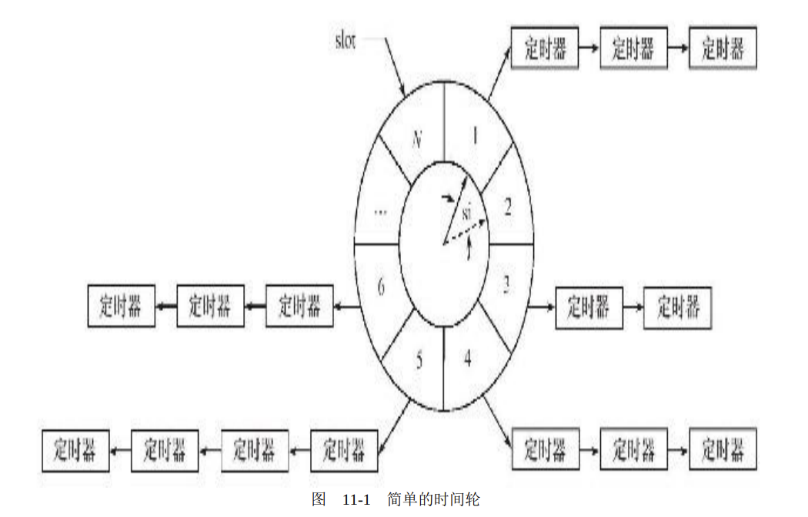

# 定时器

[TOC]

网络程序需要处理的第三类事件是定时事件，比如定期检测一个客户连接的活动状态。为此，我们要将每个定时事件分别封装成定时器，并使用某种容器类数据结构，比如链表、排序链表和时间轮，将所有定时器串联起来，以实现对定时事件的统一管理。本章主要讨论的就是两种高效的管理定时器的容器：时间轮和时间堆。

Linux提供了三种定时方法:

- socket选项SO_RCVTIMEO和SO_SNDTIMEO
- SIGALRM信号
- I/O复用系统调用的超时参数

## socket选项SO_RCVTIMEO和SO_SNDTIMEO

这两个选项分别用来设置socket接收数据超时时间，仅对send、sendmsg、recv、recvmsg、accept、connect有效。影响见下表

|系统调用|有效选项|系统调用超时后的行为|
|-|-|-|
|send|SND|返回-1，设置errno为EAGAIN或EWOULDBLOCK|
|sendmsg|SND|^|
|recv|RCV|^|
|recvmsg|RCV|^|
|accept|RCV|^|
|connect|SND|返回-1，设置errno为EINPROGRESS|

## SIGALAM信号

由alarm和setitimer函数设置的实时闹钟一旦超时，将触发SIGALRM信号。因此，我们可以利用该信号的信号处理函数来处理定时任务。但是，如果要处理多个定时任务，我们就需要不断地触发SIGALRM信号，并在其信号处理函数中执行到期的任务。一般而言，SIGALRM信号按照固定的频率生成，即由alarm或setitimer函数设置的定时周期T保持不变。如果某个定时任务的超时时间不是T的整数倍，那么它实际被执行的时间和预期的时间将略有偏差。因此定时周期T反映了定时的精度。

### 基于升序链表的定时器

从执行效率来看，添加定时器的时间复杂度是O(n)，删除定时器的时间复杂度是O(1)，执行定时任务的时间复杂度是O(1)。

### 处理非活动连接

利用alarm函数周期性地触发SIGALRM信号，该信号的信号
处理函数利用管道通知主循环执行定时器链表上的定时任务——关闭非活动的连接。

## I/O复用系统调用的超时参数

但是由于I/O复用系统调用可能在超时时间到期之前就返回（有I/O事件发生），所以如果我们
要利用它们来定时，就需要不断更新定时参数以反映剩余的时间

## 高性能定时器

### 时间轮

时间轮能够解决基于排序链表的定时器添加定时器效率偏低的问题。

要提高定时精度，就要使si值足够小；要提高执行效率，则要求N值足够大。

复杂的时间轮: 有多个轮子，不同的轮子拥有不同的粒度。相邻的两个轮子，精度高的转一圈，精度低的仅往前移动一槽，就像水表一样。

添加一个定时器的时间复杂度是O（1），删除一个定时器的时间复杂度也是O（1），执行一个定时器的时间复杂度是O（n）。但实际上执行一个定时器任务的效率要比O（n）好得多，因为时间轮将所有的定时器散列到了不同的链表上。时间轮的槽越多，等价于散列表的入口（entry）越多，从而每条链表上的定时器数量越少。

### 时间堆

设计定时器的另外一种思路是：将所有定时器中超时时间最小的一个定时器的超时值作为心搏间隔。这样，一旦心搏函数tick被调用，超时时间最小的定时器必然到期，我们就可以在tick函数中处理该定时器。然后，再次从剩余的定时器中找出超时时间最小的一个，并将这段最小时间设置为下一次心搏间隔。如此反复，就实现了较为精确的定时。

最小堆很适合处理这种定时方案。

对时间堆而言，添加一个定时器的时间复杂度是O（lgn），删除一个定时器的时间复杂度是O（1），执行一个定时器的时间复杂度是O（1）。因此，时间堆的效率是很高的。
