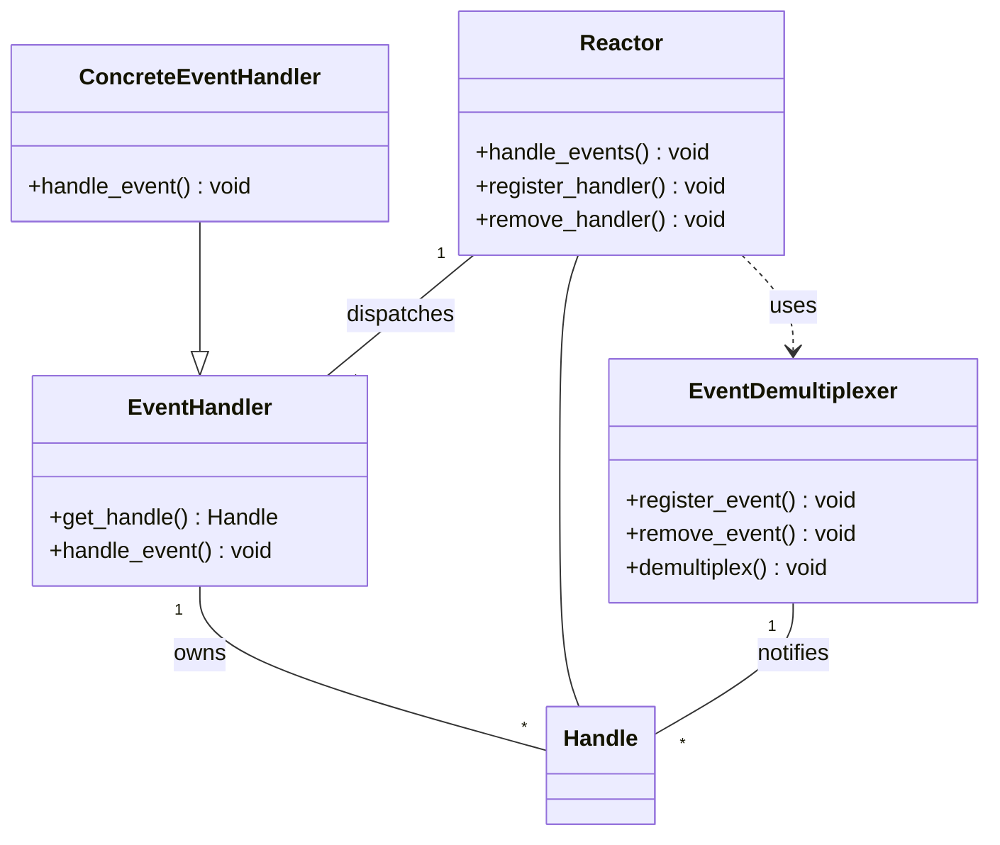
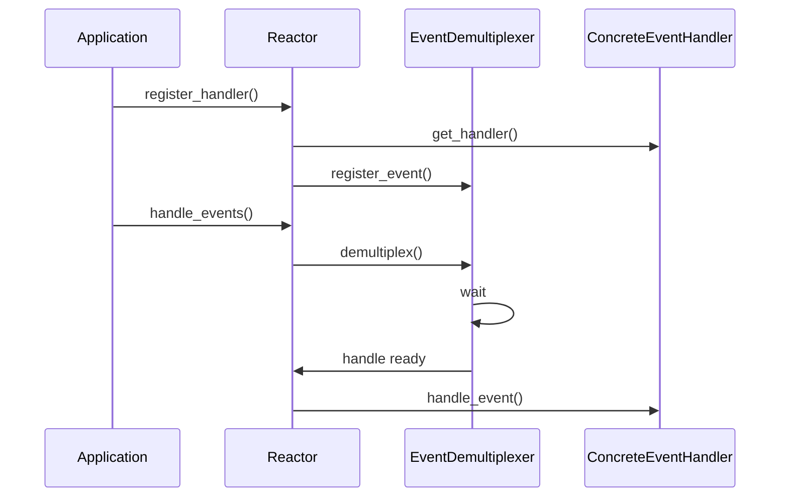

# 高性能I/O框架库libevent

[TOC]

在处理I/O事件、信号和定时事件这三类事件时我们通常需要考虑如下三个问题：

- 统一事件源 能使代码简单易懂，避免潜在的逻辑错误。方法: 使用I/O复用系统调用来管理所有事件
- 可移植性 不同操作系统有不同的I/O复用方式
- 对并发编程的支持。在多进程和多线程环境下，需要考虑各执行实体如何协同处理客户连接、信号和定时器，以避免竞态条件

开源社区: ACE、asio、libevent

## I/O框架库概述

I/O框架库以库函数的形式，封装了较为底层的系统调用，给应用程序提供了一组更便于使用的接口。这些库函数往往比程序员自己实现的同样功能的函数更合理、更高效，且更健壮。因为它们经受住了真实网络环境下的高压测试，以及时间的考验。

要么以Reactor模式实现，要么以Proactor模式实现，要么同时以两种模式实现。基于Reactor模式的I/O框架库包含以下几个组件: 句柄(Handle)、事件多路分发器(EventDemultiplexer)、事件处理器(EventHandler)和具体事件处理器(ConcreteEventHandler)、Reactor。类图见下:



1. 句柄
    I/O框架库要处理的对象，即I/O事件、信号和定时事件，统一称为事件源。一个事件源通常和一个句柄绑定在一起。句柄的作用是，当内核检测到就绪事件时，它将通过句柄来通知应用程序这一事件。在Linux环境下，I/O事件对应的句柄是文件描述符，信号事件对应的句柄就是信号值。
2. 事件多路分发器
    事件的到来是随机的、异步的。我们无法预知程序何时收到一个客户连接请求，又亦或收到一个暂停信号。所以程序需要循环地等待并处理事件，这就是事件循环。在事件循环中，等待事件一般使用I/O复用技术来实现。I/O框架库一般将系统支持的各种I/O复用系统调用封装成统一的接口，称为事件多路分发器。事件多路分发器的demultiplex方法是等待事件的核心函数，其内部调用的是select、poll、epoll_wait等函数。
    此外，事件多路分发器还需要实现register_event和remove_event方法，以供调用者往事件多路分发器中添加事件和从事件多路分发器中删除事件。
3. 事件处理器和具体事件处理器
    事件处理器执行事件对应的业务逻辑。它通常包含一个或多个handle_event回调函数，这些回调函数在事件循环中被执行。I/O框架库提供的事件处理器通常是一个接口，用户需要继承它来实现自己的事件处理器，即具体事件处理器。因此，事件处理器中的回调函数一般被声明为虚函数，以支持用户的扩展。
    此外，事件处理器一般还提供一个get_handle方法，它返回与该事件处理器关联的句柄。那么，事件处理器和句柄有什么关系？当事件多路分发器检测到有事件发生时，它是通过句柄来通知应用程序的。因此，我们必须将事件处理器和句柄绑定，才能在事件发生时获取到正确的事件处理器。
4. Reactor
    I/O框架库的核心。它提供的几个主要方法是:
    - handle_events。该方法执行事件循环。它重复如下过程：等待事件，然后依次处理所有就绪事件对应的事件处理器。
    - register_handler。该方法调用事件多路分发器的register_event方法来往事件多路分发器中注册一个事件。
    - remove_handler。该方法调用事件多路分发器的remove_event方法来删除事件多路分发器中的一个事件。

时序图:



## libevent源码分析

开源社区的一款高性能的I/O框架库，其学习者和使用者众多。使用Libevent的著名案例有: 高性能的分布式内存对象缓存软件memcached，Google浏览器Chromium的Linux版本。作为一个I/O框架库，Libevent具有如下特点:

- 跨平台支持。Libevent支持Linux、UNIX和Windows。
- 统一事件源。Libevent对I/O事件、信号和定时事件提供统一的处理。
- 线程安全。Libevent使用libevent_pthreads库来提供线程安全支持。
- 基于Reactor模式的实现。

这一节中我们将简单地研究一下Libevent源代码的主要部分。分析它除了可以更好地学习网络编程外，还有如下好处:

- 学习编写一个产品级的函数库要考虑哪些细节。
- 提高C语言功底。Libevent源码中使用了大量的函数指针，用C语言实现了多态机制，并提供了一些基础数据结构的高效实现，比如双向链表、最小堆等。

### 一个实例

hello_world: `example.cpp`

libevent库的主要逻辑:

1. 调用event_init函数创建event_base对象。一个event_base相当于一个Reactor实例。
2. 创建具体的事件处理器，并设置它们所从属的Reactor实例。evsignal_new和evtimer_new分别用于创
建信号事件处理器和定时事件处理器，它们是定义在include/event2/event.h文件中的宏：

    ```cpp
    #define evsignal_new(b, x, cb, arg)\
    event_new((b), (x), EV_SIGNAL | EV_PERSIST, (cb), (arg))
    #define evtimer_new(b,cb,arg) event_new((b),-1,0,(cb),(arg))
    ```

    可见，它们的统一入口是event_new函数，即用于创建通用事件处理器（图12-1中的EventHandler）的函数。其定义是：

    ```cpp
    struct event *event_new(struct event_base *base, evutil_socket_t fd, short events, void (*cb)(evutil_socket_t, short, void*), void *arg);
    ```

    - base 指定新创建的事件处理器从属的Reactor
    - fd 指定与该事件处理器关联的句柄。创建I/O事件处理器时，应该给fd参数传递文件描述符值；创建信号事件处理器时，应该给fd参数传递信号值，比如示例代码中的SIGINT；创建定时事件处理器时，则应该给fd参数传递-1。
    - events参数指定事件类型，其可选值都定义在include/event2/event.h文件中，如下所示

        ```cpp
        #define EV_TIMEOUT 0x01/*定时事件*/
        #define EV_READ 0x02/*可读事件*/
        #define EV_WRITE 0x04/*可写事件*/
        #define EV_SIGNAL 0x08/*信号事件*/
        #define EV_PERSIST 0x10/*永久事件*/
        /*边沿触发事件，需要I/O复用系统调用支持，比如epoll*/
        #define EV_ET 0x20
        ```

    - cb参数指定目标事件对应的回调函数，相当于事件处理器的handle_event方法。
    - arg参数则是Reactor传递给回调函数的参数。
    - event_new函数成功时返回一个event类型的对象，也就是Libevent的事件处理器。Libevent用单词"event"来描述事件处理器，而不是事件，会使读者觉得有些混乱，故而我们约定如下:
      - 事件指的是一个句柄上绑定的事件，比如文件描述符0上的可读事件。
      - 事件处理器，也就是event结构体类型的对象，除了包含事件必须具备的两个要素（句柄和事件类型）外，还有很多其他成员，比如回调函数。
      - 事件由事件多路分发器管理，事件处理器则由事件队列管理。事件队列包括多种，比如event_base中的注册事件队列、活动事件队列和通用定时器队列，以及evmap中的I/O事件队列、信号事件队列。关于这些事件队列，我们将在后文依次讨论。
      - 事件循环对一个被激活事件（就绪事件）的处理，指的是执行该事件对应的事件处理器中的回调函数。

3. 调用event_add函数，将事件处理器添加到注册事件队列中，并将该事件处理器对应的事件添加到事
件多路分发器中。event_add函数相当于Reactor中的register_handler方法。
4. 调用event_base_dispatch函数来执行事件循环。
5. 事件循环结束后，使用*_free系列函数来释放系统资源。

由此可见，该代码给我们提供了一条分析libevent源代码的主线。不过在此之前，我们先简单介绍一下libevent源代码的组织结构。

### 源代码组织结构

按照功能划分为以下几部分:

- 头文件目录`include/event2`: 主版本升级到2.0之后引入，头文件是Libevent提供给应用程序使用的，比如，event.h头文件提供核心函数，http.h头文件提供HTTP协议相关服务，rpc.h头文件提供远程过程调用支持。
- 根目录下的头文件: 分为两类，一类是对include/event2目录下的部分头文件的包装；另外一类是供Libevent内部使用的辅助性头文件，它们的文件名都具有*-internal.h的形式。
- 通用数据结构目录`compat/sys`: 该目录下仅有一个文件——queue.h。它封装了跨平台的基础数据结构，包括单向链表、双向链表、队列、尾队列和循环队列。
- `sample`目录: 提供一些示例程序
- `test`目录: 提供一些测试代码
- `WIN32-Code`目录: 提供Windows平台的专用代码
- `event.c`: 实现libevent的整体框架，主要是event和event_base两个结构体的相关操作
- `devpoll.c`、`kqueue.c`、`evport.c`、`select.c`、`win32select.c`、`poll.c`和`epoll.c`: 它们分别封装了如下I/O复用机制：/dev/poll、kqueue、event ports、POSIX select、Windows select、poll和epoll。这些文件的主要内容相似，都是针对结构体eventop（见后文）所定义的接口函数的具体实现。
- `minheap-internal.h`: 该文件实现了一个时间堆，以提供对定时事件的支持。
- `signal.c`: 它提供对信号的支持。其内容也是针对结构体eventop所定义的接口函数的具体实现。
- `evmap.c`: 它维护句柄（文件描述符或信号）与事件处理器的映射关系。
- `event_tagging.c`: 它提供往缓冲区中添加标记数据（比如一个整数），以及从缓冲区中读取标记数据的函数。
- `event_iocp.c`: 它提供对Windows IOCP（Input/Output Completion Port，输入输出完成端口）的支持。
- `buffer*.c`: 它提供对网络I/O缓冲的控制，包括：输入输出数据过滤，传输速率限制，使用SSL（Secure Sockets Layer）协议对应用数据进行保护，以及零拷贝文件传输等。
- `evthread*.c`: 它提供对多线程的支持。
- `listener.c`: 它封装了对监听socket的操作，包括监听连接和接受连接。
- `logs.c`: 它是Libevent的日志系统。
- `evutil.c`、`evutil_rand.c`、`strlcpy.c`和`arc4random.c`文件: 它们提供一些基本操作，比如生成随机数、获取socket地址信息、读取文件、设置socket属性等。
- `evdns.c`、`http.c`和`evrpc.c`: 它们分别提供了对DNS协议、HTTP协议和RPC（Remote Procedure Call，远程过程调用）协议的支持。
- `epoll_sub.c`: 该文件未见使用。

整个源码中，`event-internal.h`、`include/event2/event_struct.h`、`event.c`和`evmap.c`等4个文件最为重要。它们定义了event和event_base结构体，并实现了这两个结构体的相关操作。下面的讨论也主要是围绕这几个文件展开的。

### event结构体

事件处理器，event结构体封装了句柄、事件类型、回调函数，以及其他必要的标志和数据。(版本2.1.12已有修改，未详细查看新版文档)

```cpp
/* include/event2/event_struct.h */
struct event_callback {
    TAILQ_ENTRY(event_callback) evcb_active_next;
    short evcb_flags;
    ev_uint8_t evcb_pri;    /* smaller numbers are higher priority */
    ev_uint8_t evcb_closure;
    /* allows us to adopt for different types of events */
    union {
        void (*evcb_callback)(evutil_socket_t, short, void *);
        void (*evcb_selfcb)(struct event_callback *, void *);
        void (*evcb_evfinalize)(struct event *, void *);
        void (*evcb_cbfinalize)(struct event_callback *, void *);
    } evcb_cb_union;
    void *evcb_arg;
};

struct event {
    struct event_callback ev_evcallback;
    /* for managing timeouts */
    union {
        TAILQ_ENTRY(event) ev_next_with_common_timeout;
        int min_heap_idx;
    } ev_timeout_pos;
    evutil_socket_t ev_fd;
    struct event_base *ev_base;
    union {
        /* used for io events */
        struct {
            LIST_ENTRY (event) ev_io_next;
            struct timeval ev_timeout;
        } ev_io;
        /* used by signal events */
        struct {
            LIST_ENTRY (event) ev_signal_next;
            short ev_ncalls;
            /* Allows deletes in callback */
            short *ev_pncalls;
        } ev_signal;
    } ev_;
    short ev_events;
    short ev_res;       /* result passed to event callback */
    struct timeval ev_timeout;
};
```

- ev_events。它代表事件类型。其取值可以是代码清单12-2所示的标志的按位或（互斥的事件类型除
外，比如读写事件和信号事件就不能同时被设置）。
- ev_timeout_pos。这是一个联合体，它仅用于定时事件处理器。为了讨论的方便，后面我们称定时事件处理器为定时器。老版本的Libevent中，定时器都是由时间堆来管理的。但开发者认为有时候使用简单的链表来管理定时器将具有更高的效率。因此，新版本的Libevent就引入了所谓“通用定时器”的概念。这些定时器不是存储在时间堆中，而是存储在尾队列中，我们称之为通用定时器队列。对于通用定时器而言，ev_timeout_pos联合体的ev_next_with_common_timeout成员指出了该定时器在通用定时器队列中的位置。对于其他定时器而言，ev_timeout_pos联合体的min_heap_idx成员指出了该定时器在时间堆中的位置。一个定时器是否是通用定时器取决于其超时值大小，具体判断原则请读者自己参考event.c文件中的is_common_timeout函数。宏TAILQ_ENTRY是尾队列中的节点类型，宏LIST_ENTRY是双向链表的节点类型，它们定义在`compat/sys/queue.h`文件中:

    ```cpp
    #define TAILQ_ENTRY(type)\
    struct{\
        struct type *tqe_next;\/*下一个元素*/
        struct type **tqe_prev;\/*前一个元素的next字段地址*/
    }
    #define LIST_ENTRY(type)\
    struct {\
        struct type *le_next;\  /* next element */
        struct type **le_prev;\ /* address of previous next element */
    }
    ```

- ev_。这是一个联合体，用于处理I/O事件或信号事件。
  - 所有具有相同文件描述符值的I/O事件处理器通过ev_.ev_io.ev_io_next成员串联成一个双向链表，我们称之为I/O事件链表；
  - 所有具有相同信号值的信号事件处理器通过ev_.ev_signal.ev_signal_next成员串联成一个双向链表，我们称之为信号事件链表。ev_.ev_signal.ev_ncalls成员指定信号事件发生时，Reactor需要执行多少次该事件对应的事件处理器中的回调函数。ev_.ev_signal.ev_pncalls指针成员要么是NULL，要么指向ev_.ev_signal.ev_ncalls。
- ev_fd。对于I/O事件处理器，它是文件描述符值；对于信号事件处理器，它是信号值。
- ev_base。该事件处理器从属的event_base实例。
- ev_res。它记录当前激活事件的类型。
- ev_timeout。它仅对定时器有效，指定定时器的超时值。
- ev_evcallback 与回调函数相关的结构体
  - evcb_active_next。所有被激活的事件处理器通过该成员串联成一个尾队列，我们称之为活动事件队列。活动事件队列不止一个，不同优先级的事件处理器被激活后将被插入不同的活动事件队列中。在事件循环中，Reactor将按优先级从高到低遍历所有活动事件队列，并依次处理其中的事件处理器。
  在程序中，我们可能针对同一个socket文件描述符上的可读/可写事件创建多个事件处理器（它们拥有不同的回调函数）。当该文件描述符上有可读/可写事件发生时，所有这些事件处理器都应该被处理。所以，Libevent使用I/O事件队列将具有相同文件描述符值的事件处理器组织在一起。这样，当一个文件描述符上有事件发生时，事件多路分发器就能很快地把所有相关的事件处理器添加到活动事件队列中。信号事件队列的存在也是由于相同的原因。可见，I/O事件队列和信号事件队列并不是注册事件队列的细致分类，而是另有用处。
  - evcb_flags。它是一些事件标志。其可选值定义在include/event2/event_struct.h文件中:

    ```cpp
    #define EVLIST_TIMEOUT 0x01 /*事件处理器从属于通用定时器队列或时间堆*/
    #define EVLIST_INSERTED 0x02 /*事件处理器从属于注册事件队列*/
    #define EVLIST_SIGNAL 0x04 /*没有使用*/
    #define EVLIST_ACTIVE 0x08 /*事件处理器从属于活动事件队列*/
    #define EVLIST_INTERNAL 0x10 /*内部使用*/
    #define EVLIST_INIT 0x80 /*事件处理器已经被初始化*/
    #define EVLIST_ALL (0xf000|0x9f) /*定义所有标志*/
    ```

  - evcb_pri。它指定事件处理器优先级，值越小则优先级越高。
  - evcb_closure。它指定event_base执行事件处理器的回调函数时的行为。其可选值定义于event-internal.h文件中:

    ```cpp
    /*默认行为*/
    #define EV_CLOSURE_NONE 0
    /*执行信号事件处理器的回调函数时，调用ev.ev_signal.ev_ncalls次该回调函数*/
    #define EV_CLOSURE_SIGNAL 1
    /*执行完回调函数后，再次将事件处理器加入注册事件队列中*/
    #define EV_CLOSURE_PERSIST 2
    ```

  - evcb_cb_union。它是事件处理器的回调函数的联合体，其它几个除了evcb_selfcb不太会用
    - evcb_callback 回调函数，由event_base调用。被调用时，它的3个参数分别被传入事件处理器的如下3个成员：ev_fd、ev_res和ev_arg。
  - evcb_arg。回调函数的参数。

### 往注册事件队列中添加事件处理器

前面提到，创建一个event对象的函数是event_new（及其变体），它在event.c文件中实现。该函数的实现相当简单，主要是给event对象分配内存并初始化它的部分成员，因此我们不讨论它。event对象创建好之后，应用程序需要调用event_add函数将其添加到注册事件队列中，并将对应的事件注册到事件多路分发器上。event_add函数在event.c文件中实现，主要是调用另外一个内部函数event_add_nolock_。

```cpp
/* Implementation function to add an event.  Works just like event_add,
 * except: 1) it requires that we have the lock.  2) if tv_is_absolute is set,
 * we treat tv as an absolute time, not as an interval to add to the current
 * time */
int
event_add_nolock_(struct event *ev, const struct timeval *tv,
    int tv_is_absolute)
{
    struct event_base *base = ev->ev_base;
    int res = 0;
    int notify = 0;

    EVENT_BASE_ASSERT_LOCKED(base);
    event_debug_assert_is_setup_(ev);

    event_debug((
        "event_add: event: %p (fd "EV_SOCK_FMT"), %s%s%s%scall %p",
        ev,
        EV_SOCK_ARG(ev->ev_fd),
        ev->ev_events & EV_READ ? "EV_READ " : " ",
        ev->ev_events & EV_WRITE ? "EV_WRITE " : " ",
        ev->ev_events & EV_CLOSED ? "EV_CLOSED " : " ",
        tv ? "EV_TIMEOUT " : " ",
        ev->ev_callback));

    EVUTIL_ASSERT(!(ev->ev_flags & ~EVLIST_ALL));

    if (ev->ev_flags & EVLIST_FINALIZING) {
        /* XXXX debug */
        return (-1);
    }

    /*
    * prepare for timeout insertion further below, if we get a
    * failure on any step, we should not change any state.
    */
    if (tv != NULL && !(ev->ev_flags & EVLIST_TIMEOUT)) {
        if (min_heap_reserve_(&base->timeheap,
            1 + min_heap_size_(&base->timeheap)) == -1)
            return (-1);  /* ENOMEM == errno */
    }

    /* If the main thread is currently executing a signal event's
    * callback, and we are not the main thread, then we want to wait
    * until the callback is done before we mess with the event, or else
    * we can race on ev_ncalls and ev_pncalls below. */
#ifndef EVENT__DISABLE_THREAD_SUPPORT
    if (base->current_event == event_to_event_callback(ev) &&
        (ev->ev_events & EV_SIGNAL)
        && !EVBASE_IN_THREAD(base)) {
        ++base->current_event_waiters;
        EVTHREAD_COND_WAIT(base->current_event_cond, base->th_base_lock);
    }
#endif

    if ((ev->ev_events & (EV_READ|EV_WRITE|EV_CLOSED|EV_SIGNAL)) &&
        !(ev->ev_flags & (EVLIST_INSERTED|EVLIST_ACTIVE|EVLIST_ACTIVE_LATER))) {
        if (ev->ev_events & (EV_READ|EV_WRITE|EV_CLOSED))
            res = evmap_io_add_(base, ev->ev_fd, ev);
        else if (ev->ev_events & EV_SIGNAL)
            res = evmap_signal_add_(base, (int)ev->ev_fd, ev);
        if (res != -1)
            event_queue_insert_inserted(base, ev);
        if (res == 1) {
            /* evmap says we need to notify the main thread. */
            notify = 1;
            res = 0;
        }
    }

    /*
    * we should change the timeout state only if the previous event
    * addition succeeded.
    */
    if (res != -1 && tv != NULL) {
        struct timeval now;
        int common_timeout;
#ifdef USE_REINSERT_TIMEOUT
        int was_common;
        int old_timeout_idx;
#endif

        /*
        * for persistent timeout events, we remember the
        * timeout value and re-add the event.
        *
        * If tv_is_absolute, this was already set.
        */
        if (ev->ev_closure == EV_CLOSURE_EVENT_PERSIST && !tv_is_absolute)
            ev->ev_io_timeout = *tv;

#ifndef USE_REINSERT_TIMEOUT
        if (ev->ev_flags & EVLIST_TIMEOUT) {
            event_queue_remove_timeout(base, ev);
        }
#endif

        /* Check if it is active due to a timeout.  Rescheduling
        * this timeout before the callback can be executed
        * removes it from the active list. */
        if ((ev->ev_flags & EVLIST_ACTIVE) &&
            (ev->ev_res & EV_TIMEOUT)) {
            if (ev->ev_events & EV_SIGNAL) {
                /* See if we are just active executing
                * this event in a loop
                */
                if (ev->ev_ncalls && ev->ev_pncalls) {
                    /* Abort loop */
                    *ev->ev_pncalls = 0;
                }
            }

            event_queue_remove_active(base, event_to_event_callback(ev));
        }

        gettime(base, &now);

        common_timeout = is_common_timeout(tv, base);
#ifdef USE_REINSERT_TIMEOUT
        was_common = is_common_timeout(&ev->ev_timeout, base);
        old_timeout_idx = COMMON_TIMEOUT_IDX(&ev->ev_timeout);
#endif

        if (tv_is_absolute) {
            ev->ev_timeout = *tv;
        } else if (common_timeout) {
            struct timeval tmp = *tv;
            tmp.tv_usec &= MICROSECONDS_MASK;
            evutil_timeradd(&now, &tmp, &ev->ev_timeout);
            ev->ev_timeout.tv_usec |=
                (tv->tv_usec & ~MICROSECONDS_MASK);
        } else {
            evutil_timeradd(&now, tv, &ev->ev_timeout);
        }

        event_debug((
            "event_add: event %p, timeout in %d seconds %d useconds, call %p",
            ev, (int)tv->tv_sec, (int)tv->tv_usec, ev->ev_callback));

#ifdef USE_REINSERT_TIMEOUT
        event_queue_reinsert_timeout(base, ev, was_common, common_timeout, old_timeout_idx);
#else
        event_queue_insert_timeout(base, ev);
#endif

        if (common_timeout) {
            struct common_timeout_list *ctl =
                get_common_timeout_list(base, &ev->ev_timeout);
            if (ev == TAILQ_FIRST(&ctl->events)) {
                common_timeout_schedule(ctl, &now, ev);
            }
        } else {
            struct event* top = NULL;
            /* See if the earliest timeout is now earlier than it
            * was before: if so, we will need to tell the main
            * thread to wake up earlier than it would otherwise.
            * We double check the timeout of the top element to
            * handle time distortions due to system suspension.
            */
            if (min_heap_elt_is_top_(ev))
                notify = 1;
            else if ((top = min_heap_top_(&base->timeheap)) != NULL &&
                    evutil_timercmp(&top->ev_timeout, &now, <))
                notify = 1;
        }
    }

    /* if we are not in the right thread, we need to wake up the loop */
    if (res != -1 && notify && EVBASE_NEED_NOTIFY(base))
        evthread_notify_base(base);

    event_debug_note_add_(ev);

    return (res);
}
```

内部调用了几个重要的函数:

- evmap_io_add。该函数将I/O事件添加到事件多路分发器中，并将对应的事件处理器添加到I/O事件队列中，同时建立I/O事件和I/O事件处理器之间的映射关系。我们将在下一节详细讨论该函数。
- evmap_signal_add。该函数将信号事件添加到事件多路分发器中，并将对应的事件处理器添加到信号事件队列中，同时建立信号事件和信号事件处理器之间的映射关系。
- event_queue_insert。该函数将事件处理器添加到各种事件队列中：将I/O事件处理器和信号事件处理器插入注册事件队列；将定时器插入通用定时器队列或时间堆；将被激活的事件处理器添加到活动事件队列中。代码如下

    ```cpp
    static void event_queue_insert(struct event_base *base, struct event *ev, int queue) {
        EVENT_BASE_ASSERT_LOCKED(base);
        /*避免重复插入*/
        if(ev->ev_flags & queue){
            /*Double insertion is possible for active events*/
            if(queue & EVLIST_ACTIVE)
                return;
            event_errx(1, "%s:%p(fd%d)already on queue%x", __func__, ev, ev->ev_fd, queue);
            return;
        }
        if(~ev->ev_flags & EVLIST_INTERNAL)
            base->event_count++;/*将event_base拥有的事件处理器总数加1*/
        ev->ev_flags |= queue;/*标记此事件已被添加过*/
        switch(queue){
        /*将I/O事件处理器或信号事件处理器插入注册事件队列*/
        case EVLIST_INSERTED:
            TAILQ_INSERT_TAIL(&base->eventqueue, ev, ev_next);
            break;
        /*将就绪事件处理器插入活动事件队列*/
        case EVLIST_ACTIVE:
            base->event_count_active++;
            TAILQ_INSERT_TAIL(&base->activequeues[ev->ev_pri], ev, ev_active_next);
            break;
        /*将定时器插入通用定时器队列或时间堆*/
        case EVLIST_TIMEOUT: {
            if(is_common_timeout(&ev->ev_timeout, base)){
                struct common_timeout_list *ctl = get_common_timeout_list(base, &ev->ev_timeout);
                insert_common_timeout_inorder(ctl, ev);
            }
            else
                min_heap_push(&base->timeheap, ev);
            break;
            }
        default:
            event_errx(1, "%s:unknown queue%x", __func__, queue);
        }
    }
    ```

### 往事件多路分发器中注册事件

2.1.12和2.0.19版本差异太大，先看后面章节

### eventop结构体

### event_base结构体

### 事件循环
