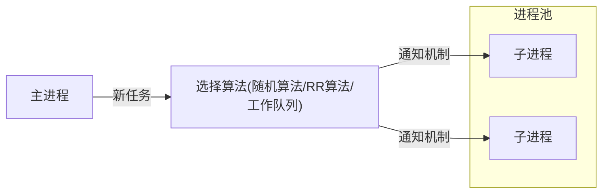

# 进程池和线程池

[TOC]

在前面的章节中，我们是通过动态创建子进程（或子线程）来实现并发服务器的。这样做有如下缺点:

- 动态创建进程（或线程）是比较耗费时间的，这将导致较慢的客户响应。
- 动态创建的子进程（或子线程）通常只用来为一个客户服务（除非我们做特殊的处理），这将导致系统上产生大量的细微进程（或线程）。进程（或线程）间的切换将消耗大量CPU时间。
- 动态创建的子进程是当前进程的完整映像。当前进程必须谨慎地管理其分配的文件描述符和堆内存等系统资源，否则子进程可能复制这些资源，从而使系统的可用资源急剧下降，进而影响服务器的性能。

第8章介绍过的进程池和线程池可以解决上述问题。本章将分析这两种“池”的细节，给出它们的通用实现，并分别用进程池和线程池来实现简单的并发服务器。

## 概述

进程池和线程池相似，所以这里我们只以进程池为例进行介绍。如没有特殊声明，下面对进程池的讨论完全适用于线程池。

进程池是由服务器预先创建的一组子进程，这些子进程的数目在3～10个之间（当然，这只是典型情况）。比如13.5.5小节所描述的，httpd守护进程就是使用包含7个子进程的进程池来实现并发的。线程池中的线程数量应该和CPU数量差不多。

进程池中的所有子进程都运行着相同的代码，并具有相同的属性，比如优先级、PGID等。因为进程池在服务器启动之初就创建好了，所以每个子进程都相对“干净”，即它们没有打开不必要的文件描述符（从父进程继承而来），也不会错误地使用大块的堆内存（从父进程复制得到）。当有新的任务到来时，主进程将通过某种方式选择进程池中的某一个子进程来为之服务。相比于动态创建子进程，选择一个已经存在的子进程的代价显然要小得多。至于主进程选择哪个子进程来为新任务服务，则有两种方式:

- 主进程使用某种算法来主动选择子进程。最简单、最常用的算法是随机算法和Round Robin（轮流选取）算法，但更优秀、更智能的算法将使任务在各个工作进程中更均匀地分配，从而减轻服务器的整体压力。
- 主进程和所有子进程通过一个共享的工作队列来同步，子进程都睡眠在该工作队列上。当有新的任务到来时，主进程将任务添加到工作队列中。这将唤醒正在等待任务的子进程，不过只有一个子进程将获得新任务的“接管权”，它可以从工作队列中取出任务并执行之，而其他子进程将继续睡眠在工作队列上。当选择好子进程后，主进程还需要使用某种通知机制来告诉目标子进程有新任务需要处理，并传递必要的数据。最简单的方法是，在父进程和子进程之间预先建立好一条管道，然后通过该管道来实现所有的进程间通信（当然，要预先定义好一套协议来规范管道的使用）。在父线程和子线程之间传递数据就要简单得多，因为我们可以把这些数据定义为全局的，那么它们本身就是被所有线程共享的。综合上面的论述，我们将进程池的一般模型描绘为图15-1所示的形式。

## 处理多客户

在使用进程池处理多客户任务时，首先要考虑的一个问题是：监听socket和连接socket是否都由主进程来统一管理。回忆第8章中我们介绍过的几种并发模式，其中半同步/半反应堆模式是由主进程统一管理这两种socket的；而图8-11所示的高效的半同步/半异步模式，以及领导者/追随者模式，则是由主进程管理所有监听socket，而各个子进程分别管理属于自己的连接socket的。对于前一种情况，主进程接受新的连接以得到连接socket，然后它需要将该socket传递给子进程（对于线程池而言，父线程将socket传递给子线程是很简单的，因为它们可以很容易地共享该socket。但对于进程池而言，我们必须使用13.9节介绍的方法来传递该socket）。后一种情况的灵活性更大一些，因为子进程可以自己调用accept来接受新的连接，这样父进程就无须向子进程传递socket，而只需要简单地通知一声：“我检测到新的连接，你来接受它。”

在4.6.1小节中我们曾讨论过常连接，即一个客户的多次请求可以复用一个TCP连接。那么，在设计进程池时还需要考虑：一个客户连接上的所有任务是否始终由一个子进程来处理。如果说客户任务是无状态的，那么我们可以考虑使用不同的子进程来为该客户的不同请求服务。

但如果客户任务是存在上下文关系的，则最好一直用同一个子进程来为之服务，否则实现起来将比较
麻烦，因为我们不得不在各子进程之间传递上下文数据。在9.3.4小节中，我们讨论了epoll的
EPOLLONESHOT事件，这一事件能够确保一个客户连接在整个生命周期中仅被一个线程处理。

## 半同步/半异步进程池实现

本节实现一个基于图8-11所示的半同步/半异步并发模式的进程池，见`processpool.hpp`。为了避免在父、子进程之间传递文件描述符，我们将接受新连接的操作放到子进程中。很显然，对于这种模式而言，一个客户连接上的所有任务始终是由一个子进程来处理的。

## 用进程池实现的简单CGI服务器

利用前面介绍的进程池来重新实现一个并发的CGI服务器，见`CGIserver.cpp`

## 半同步/半反应堆线程池实现

本节实现一个基于图8-10所示的半同步/半反应堆并发模式的线程池，如`threadpool.hpp`所示。相比`processpool.hpp`的进程池实现，该线程池的通用性要高得多，因为它使用一个工作队列完全解除了主线程和工作线程的耦合关系：主线程往工作队列中插入任务，工作线程通过竞争来取得任务并执行它。不过，如果要将该线程池应用到实际服务器程序中，那么我们必须保证所有客户请求都是无状态的，因为同一个连接上的不同请求可能会由不同的线程处理。

值得一提的是，在C++程序中使用pthread_create函数时，该函数的第3个参数必须指向一个静态函数。而要在一个静态函数中使用类的动态成员（包括成员函数和成员变量），则只能通过如下两种方式来实现:

- 通过类的静态对象来调用。比如单体模式中，静态函数可以通过类的全局唯一实例来访问动态成员函数。
- 将类的对象作为参数传递给该静态函数，然后在静态函数中引用这个对象，并调用其动态方法。`threadpool.hpp`中使用的是第2种方式：将线程参数设置为this指针，然后在worker函数中获取该指针并调用其动态方法run。

## 用线程池实现的简单Web服务器

在8.6节中，曾使用有限状态机实现过一个非常简单的解析HTTP请求的服务器。下面将利用前面介绍的线程池来重新实现一个并发的Web服务器。

### http_conn类

首先，需要准备线程池的模板参数类，用以封装对逻辑任务的处理。这个类是http_conn，见头文件`http_conn.h`和实现文件`http_conn.cpp`

### main函数

main函数很简单，它只需要负责I/O读写。见`webserver.cpp`。服务器程序经过测试，可以相应Microsoft Edge、Firefox、Postman的请求(均在Linux平台)。
